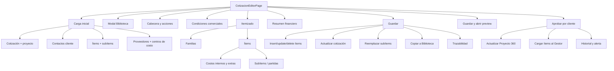

# Plan de Refactor Estructural - Cotizador de Proyecto 360

Fecha: 22 de junio de 2026

Archivo principal auditado: `app/proyectos/[id]/cotizaciones/[cotId]/page.tsx`

Archivos relacionados consultados:

- `app/proyectos/[id]/page.tsx`
- `app/proyectos/[id]/cotizaciones/[cotId]/preview/page.tsx`
- `lib/gestor.ts`
- `app/liquidaciones/page.tsx`

Estado: diagnóstico y propuesta. Esta entrega no modifica comportamiento, UI, queries, permisos, fórmulas, PDF ni preview.

## A. Resumen ejecutivo

El editor de cotizaciones es una pantalla cliente de 1,294 líneas que concentra cinco responsabilidades sensibles:

1. Carga y normalización de cotización, proyecto, contactos, ítems y catálogos.
2. Edición tabular de familias, ítems, subítems, costos internos y extras.
3. Cálculo de costos, precios, fee, descuento, IGV y margen.
4. Persistencia con control optimista de concurrencia.
5. Aprobación por cliente y sincronización con Proyecto 360, Gestor, historial y alertas.

Inventario técnico:

| Indicador | Cantidad |
|---|---:|
| Estados React (`useState`) | 26 |
| Referencias (`useRef`) | 7 |
| Efectos (`useEffect`) | 6 |
| Llamadas Supabase `.from()` | 28 |
| Operaciones `await` | 40 |
| Diálogos `alert` / `confirm` | 10 |
| Tablas Supabase directas | 12 |

El archivo sí contiene piezas puras que pueden extraerse con bajo riesgo (`calcItem`, constructores de filas y formateo), pero la persistencia no es una operación simple: elimina filas ausentes, inserta o actualiza ítems uno por uno, actualiza cabecera, reemplaza subítems, copia a Biblioteca y registra trazabilidad.

La recomendación principal es refactorizar por capas:

1. Tipos, cálculos puros y componentes visuales.
2. Estado de edición y persistencia, conservando exactamente las queries.
3. Aprobaciones e integraciones solo cuando exista cobertura de regresión.

### Hallazgos que no deben corregirse dentro del refactor estructural

- El autoguardado destructivo está explícitamente desactivado.
- Permanecen estados y refs residuales de autoguardado/respaldo.
- El preview recalcula fee e IGV, pero no aplica el descuento del editor.
- `generarRQs` está definida en el editor, pero no tiene invocaciones.
- La aprobación interna del proyecto vive en Proyecto 360, no en este editor.
- Las mutaciones no son transaccionales y pueden dejar estados parciales.

Estos puntos requieren tareas funcionales separadas.

## B. Mapa funcional del archivo

### B.1 Distribución por rangos

| Rango aproximado | Responsabilidad |
|---|---|
| 1-21 | Imports, roles y catálogo de costos |
| 23-40 | Cálculo financiero por ítem |
| 42-78 | Constructores de familia, campo extra e ítem |
| 80-116 | Contexto y estado React |
| 118-200 | Carga inicial |
| 202-227 | Biblioteca de ítems |
| 229-300 | Mutaciones locales de ítems, extras y subítems |
| 301-313 | Totales globales |
| 315-397 | Constructor/generador de RQ actualmente no invocado |
| 399-463 | Copia de ítems a Biblioteca |
| 465-475 | Refs de operaciones y espera de guardado |
| 476-605 | Guardado completo |
| 607-633 | Preparación de PDF/preview |
| 635-689 | Aprobación por cliente |
| 691-707 | Permisos, autosave desactivado y refs residuales |
| 711-840 | Modales, avisos, cabecera e historial |
| 843-893 | Condiciones comerciales |
| 894-1257 | Itemizado y costos internos |
| 1259-1276 | Resumen financiero |

### B.2 Árbol funcional



### B.3 Carga inicial

Secuencia actual:

1. Cargar cotización con proyecto y cliente.
2. Inicializar timestamp de concurrencia.
3. Inicializar fee, descuento, contacto y columna extra.
4. Cargar contactos por `cliente.id`.
5. Cargar historial de aprobación.
6. Volver a buscar cliente por razón social.
7. Volver a cargar contactos por el ID obtenido.
8. Cargar usuario y perfil.
9. Decidir si la cotización se muestra bloqueada.
10. Cargar ítems.
11. Parsear extras JSON y recalcular cada ítem.
12. Cargar subítems secuencialmente por ítem.
13. Cargar proveedores.
14. Cargar centros de costo.

Observaciones:

- Los contactos se consultan por dos caminos.
- Los subítems generan un patrón N+1.
- No existe un estado visible de error por fuente.
- La query y el orden deben preservarse en una primera extracción.

### B.4 Biblioteca

Flujo:

- Carga diferida de `items_biblioteca`.
- Búsqueda local por descripción.
- Copia de datos de costo/margen/proveedor al nuevo ítem.
- Cierre del modal.

El ítem copiado se recalcula mediante `calcItem`.

### B.5 Condiciones comerciales

Campos:

- Condición de pago.
- Días de validez.
- Porcentaje de IGV.
- Margen objetivo.
- Descuento.
- Contacto del cliente.

El margen objetivo se edita y persiste en el objeto local, pero el bloque de guardado auditado no lo incluye en el update de cabecera.

### B.6 Itemizado

Tipos de fila:

- `familia`
- `item`
- `celda_extra`

Capacidades:

- Agregar, quitar y reordenar.
- Asociar ítem a familia.
- Definir cantidad y días.
- Precio manual al cliente.
- Costo unitario manual.
- Margen.
- Inclusión en total.
- Columna extra configurable.
- Centro de costo.
- Proveedor.
- Costos internos.
- Extras de producción.
- Extras de alquiler/RRHH.
- Subítems/partidas.

### B.7 Resumen financiero

Muestra:

- Subtotal costo.
- Precio cliente.
- Fee de agencia.
- Subtotal con fee.
- Descuento.
- IGV.
- Total cliente.
- Margen global en monto y porcentaje.

## C. Mapa de estado

### C.1 Estado de datos

| Estado | Tipo conceptual | Consumidores |
|---|---|---|
| `cotizacion` | Cabecera editable | condiciones, cálculos, guardado, aprobación |
| `proyecto` | Contexto | cabecera, biblioteca, aprobación, rutas |
| `items` | Colección principal | tabla, totales, guardado, Gestor |
| `subitems` | Partidas por ítem | costos, guardado, posible RQ |
| `proveedores` | Catálogo | ítems, subítems, RQ |
| `centrosCostos` | Catálogo | detalle y Biblioteca |
| `biblioteca` | Catálogo diferido | modal |
| `contactosCliente` | Catálogo | destinatario |
| `historialAprobacion` | Auditoría | bloque de historial |
| `perfilActual` | Seguridad/contexto | aprobar, bloquear, RQ |

### C.2 Estado de UI

| Estado | Responsabilidad | Destino futuro |
|---|---|---|
| `loading` | Carga inicial | data hook |
| `saving` | Persistencia | save hook |
| `generatingPdf` | Preparación de preview | preview hook |
| `expandedItems` | Filas expandidas | tabla/local |
| `showBiblioteca` | Modal | biblioteca/local |
| `busquedaBib` | Filtro modal | biblioteca/local |
| `bloqueada` | Bloqueo visible | access hook |
| `feeActivo` | Configuración comercial | quote editor state |
| `descuentoPct` | Configuración comercial | quote editor state |
| `columnaExtra` | Configuración tabla | quote editor state |
| `contactoClienteId` | Destinatario | quote editor state |
| `hasBackup` | Recuperación local residual | revisar antes de extraer |

### C.3 Estado de concurrencia y operaciones

| Estado/ref | Uso actual | Observación |
|---|---|---|
| `loadedUpdatedAt` | Timestamp cargado | Se asigna, pero el render no lo usa |
| `loadedUpdatedAtRef` | Comparar con BD | No se actualiza tras guardar |
| `concurrencyBlocked` | Aviso de conflicto | El aviso está detrás de `false &&` |
| `concurrencyBlockedRef` | Bloqueo efectivo | Sí interviene en `guardar` |
| `autoSaveRef` | Intervalo histórico | Se limpia, nunca se configura |
| `savingRef` | Espera de guardado | Usado por PDF |
| `generatingPdfRef` | Ref de PDF | Se actualiza, no gobierna otra función |
| `itemsRef` | Snapshot histórico | Se actualiza, no se consume |
| `lastSaved` | Texto de autoguardado | No se actualiza |

### C.4 Respaldo local

Existe UI para:

- Leer `cot_backup_[cotId]`.
- Recuperar `items`.
- Descartar backup.

No se encontró en el archivo:

- Escritura mediante `localStorage.setItem`.
- Detección que active `hasBackup`.
- Respaldo de cabecera, subítems, fee, descuento o contacto.

Por tanto, el flujo está incompleto o depende de código retirado.

### C.5 Recomendación de ownership

Debe permanecer en el contenedor durante las primeras fases:

- Cotización.
- Ítems.
- Subítems.
- Perfil.
- Timestamp de concurrencia.
- Guardado.
- Aprobación.

Puede hacerse local en componentes:

- Filas expandidas.
- Modal Biblioteca.
- Filtro de Biblioteca.
- Presentación de historial.

No se recomienda Context API inicialmente. Los contratos todavía son sensibles y conviene hacer dependencias explícitas.

## D. Mapa de funciones

### D.1 Funciones puras

| Función | Responsabilidad | Riesgo |
|---|---|---|
| `calcItem` | Calcular costo, precio y margen de un ítem | Crítico |
| `newFamilia` | Crear fila familia | Bajo |
| `newCeldaExtra` | Crear campo adicional | Bajo |
| `newItem` | Crear ítem con defaults y cálculo | Medio |
| `fmt` | Formato monetario | Bajo |

### D.2 Mutaciones locales

| Función | Estado afectado |
|---|---|
| `cargarDesdeLibreria` | items, modal, búsqueda |
| `toggleExpand` | expandedItems |
| `updateItem` | items y recálculo |
| `addExtra` | extras + recálculo |
| `updateExtra` | extras + recálculo |
| `removeExtra` | extras + recálculo |
| `removeItem` | items |
| `moverItem` | items y orden |
| `addSubitem` | subitems |
| `updateSubitem` | subitems, costo_manual, items |
| `removeSubitem` | subitems, costo_manual, items |

### D.3 Funciones de datos

| Función | Responsabilidad | Efectos |
|---|---|---|
| `load` interno | Carga completa | 8 grupos de consultas |
| `abrirBiblioteca` | Carga catálogo | `items_biblioteca` |
| `copiarItemsABiblioteca` | Crear conocimiento reutilizable | auth + select + insert |
| `guardar` | Persistencia completa | delete/insert/update + trazabilidad |

### D.4 Funciones críticas de negocio

#### `guardar`

Secuencia:

1. Validar IDs.
2. Resolver forzado manual.
3. Consultar `updated_at`.
4. Detectar conflicto.
5. Consultar IDs actuales.
6. Eliminar ítems ausentes.
7. Insertar nuevos ítems.
8. Actualizar existentes.
9. Reemplazar IDs temporales en estado.
10. Actualizar totales y condiciones de cotización.
11. Borrar y reinsertar subítems por ítem.
12. Copiar ítems a Biblioteca.
13. Registrar trazabilidad.

Riesgo: no existe transacción única.

#### `descargarPdf`

Secuencia:

1. Abrir ventana anticipada para evitar bloqueo del navegador.
2. Esperar que termine un guardado.
3. Forzar guardado silencioso.
4. Navegar la ventana al preview.

No genera el PDF dentro del editor; prepara los datos y abre la ruta preview.

#### `marcarAprobadoPorCliente`

Secuencia:

1. Validar rol.
2. Confirmar.
3. Forzar guardado.
4. Aprobar y bloquear cotización.
5. Cambiar otras aprobadas a enviadas.
6. Actualizar `cotizacion_aprobada_id` del proyecto.
7. Cargar ítems al Gestor.
8. Registrar historial.
9. Registrar trazabilidad.
10. Enviar alerta.
11. Actualizar UI.
12. Volver a Proyecto 360.

#### `generarRQs`

Construye RQ desde ítems y subítems con proveedor, además elimina de BD ítems ausentes del estado.

Hallazgo: no tiene invocaciones en el archivo. No debe moverse como flujo activo sin decidir primero si es código residual o capacidad futura.

## E. Fórmulas y cálculos críticos

### E.1 Costo base

```text
costoBase =
  almacenaje
  + impresión
  + permisos
  + instalación
  + performer
  + alquiler
  + supervisión
  + movilidad
  + extras producción
  + extras alquiler/RRHH
```

Hallazgo: `costo_otros` se persiste y copia a Biblioteca, pero no está incluido en `COSTOS_INTERNOS` ni en `costoBase`.

### E.2 Costo unitario

```text
costoUnitario =
  costo_manual, si existe
  de lo contrario costoBase
```

Los subítems actualizan `costo_manual` con la suma de sus montos.

### E.3 Costo total

```text
costoTotal = costoUnitario × cantidad × fechas
```

Defaults efectivos:

- cantidad: 1
- fechas: 1

### E.4 Precio al cliente automático

```text
precioCliente =
  costoTotal / (1 - margenPct / 100)
```

Solo se aplica si `margenPct < 100`. Para 100 o más, usa `costoTotal`.

### E.5 Precio al cliente manual

```text
precioCliente =
  precioClienteManual × cantidad × fechas
```

El valor manual en la tabla representa precio unitario, no total.

### E.6 Redondeo

```text
precioClienteRounded = round(precioCliente, 2)
margenMonto = round(precioClienteRounded - costoTotal, 2)
```

### E.7 Margen del ítem

Con precio manual:

```text
margenCalculado =
  (precioCliente - costoTotal) / precioCliente × 100
```

Sin precio manual:

```text
margenFinal = margenPct ingresado
```

### E.8 Ítems incluidos

Los totales consideran solo:

- tipo distinto de `familia`
- tipo distinto de `celda_extra`
- `incluir_en_total !== false`

`es_opcional` no excluye automáticamente el ítem.

### E.9 Totales globales

```text
totalCosto = suma(costo_total de ítems activos)
totalPrecioCliente = suma(precio_cliente de ítems activos)
feePct = fee activo ? porcentaje configurado : 0
feeMonto = totalPrecioCliente × feePct / 100
subtotalConFee = totalPrecioCliente + feeMonto
descuentoMonto = subtotalConFee × descuentoPct / 100
subtotalConDescuento = subtotalConFee - descuentoMonto
igvMonto = subtotalConDescuento × igvPct / 100
totalFinal = subtotalConDescuento + igvMonto
margenGlobalMonto = subtotalConDescuento - totalCosto
margenGlobal = margenGlobalMonto / subtotalConDescuento × 100
```

### E.10 Subtotal de familia

```text
subtotalFamilia =
  suma(precio_cliente de hijos con incluir_en_total !== false)
```

### E.11 Persistencia de totales

La cotización guarda:

- `subtotal_costo`
- `subtotal_precio_cliente`
- `fee_agencia_monto`
- `fee_agencia_pct`
- `fee_activo`
- `subtotal_con_fee`
- `igv_monto`
- `igv_pct`
- `total_cliente`
- `margen_pct`
- `descuento_pct`

No se persiste explícitamente `subtotalConDescuento`.

### E.12 Diferencia con preview/PDF

El preview auditado calcula:

```text
totalPrecioCliente
+ fee
+ IGV sobre subtotal con fee
```

No aplica `descuento_pct`.

Consecuencia: una cotización con descuento puede mostrar un total en el editor y otro en preview/PDF. Este es un riesgo funcional existente y debe resolverse en una tarea específica; esta rama no toca preview.

## F. Integraciones y efectos colaterales

### F.1 Supabase

Tablas directas:

1. `cotizaciones`
2. `proyectos`
3. `clientes`
4. `cliente_contactos`
5. `cotizacion_historial`
6. `cotizacion_items`
7. `cotizacion_subitems`
8. `proveedores`
9. `centro_costos`
10. `items_biblioteca`
11. `perfiles`
12. `requerimientos_pago`

### F.2 Proyecto 360

Dependencias:

- Ruta padre y navegación.
- `cotizacion_aprobada_id`.
- Estado visible de la versión.
- Totales y margen mostrados en la tabla de proformas.
- Flujo interno de aprobación del proyecto.
- Inicio de proyecto y generación de RQ desde pre-cuadre.

### F.3 Aprobación interna

No existe una función de aprobación interna dentro del editor.

El flujo:

```text
pendiente_aprobacion
→ aprobado_produccion
→ aprobado_gerencia
```

pertenece al estado del proyecto en `app/proyectos/[id]/page.tsx`.

El editor:

- permite editar la cotización;
- puede quedar bloqueado desde Proyecto 360;
- realiza aprobación formal del cliente.

No deben mezclarse ambos flujos al extraer hooks.

### F.4 Aprobación del cliente

Roles:

- `superadmin`
- `gerente_general`

Efectos:

- fuerza guardado;
- estado `aprobada_cliente`;
- bloqueo;
- marca otras aprobadas como `enviada_cliente`;
- enlaza proyecto;
- carga Gestor;
- escribe historial;
- escribe trazabilidad;
- envía alerta.

### F.5 Gestor

`cargarItemsAprobadosAlGestor`:

- lee cotización, proyecto, productor e ítems;
- excluye familias, celdas extra e ítems no incluidos;
- evita duplicados por `cotizacion_item_id`;
- crea `proyecto_tareas` pendientes;
- copia costo presupuestado y precio cliente.

Riesgo: una aprobación puede completarse aunque la sincronización con Gestor falle.

### F.6 RQ

`generarRQs` puede construir RQ en `pendiente_aprobacion`, pero actualmente no se invoca desde la UI del editor.

El flujo activo de RQ para iniciar proyecto reside en el pre-cuadre de Proyecto 360.

No debe asumirse que aprobar cotización genera RQ.

### F.7 Liquidaciones

Liquidaciones consume:

- cotización `aprobada_cliente`;
- `subtotal_costo`;
- `total_cliente`;
- `margen_pct`;
- `cotizacion_items`.

Cambiar cálculos, inclusión de ítems o persistencia altera el presupuesto base de liquidación.

### F.8 Biblioteca

Después de guardar, los ítems persistidos se copian a `items_biblioteca` si no fueron importados antes desde esa cotización/ítem.

El guardado de la cotización puede considerarse exitoso aunque la copia a Biblioteca falle, porque ese error solo se registra en consola.

### F.9 PDF/preview

El editor no importa el renderer.

Flujo:

1. Guardar.
2. Abrir `/preview`.
3. Preview vuelve a consultar cotización e ítems.
4. Preview genera el PDF con `@react-pdf/renderer`.

Por esta razón, el refactor del editor debe preservar la persistencia previa a abrir preview.

## G. Riesgos de refactor

| ID | Riesgo | Severidad | Evidencia / mitigación |
|---|---|---|---|
| COT-01 | Alterar fórmula de margen | Crítica | Congelar casos numéricos de `calcItem` |
| COT-02 | Perder descuento en PDF | Alta | Ya existe divergencia; no mezclar corrección con refactor |
| COT-03 | Guardado parcial sin transacción | Crítica | Mantener orden y agregar pruebas antes de mover |
| COT-04 | Eliminar ítems por snapshot incompleto | Crítica | Preservar control de IDs y evitar autosave |
| COT-05 | Subítems de ítem nuevo no persistidos en la misma pasada | Alta | Mapear IDs temporales antes de subítems en futura corrección |
| COT-06 | Conflicto propio tras guardar | Alta | `loadedUpdatedAtRef` no se refresca después del update |
| COT-07 | Forzado de guardado omite conflicto | Alta | PDF/aprobación llaman `guardar(true, true)` |
| COT-08 | Bloqueo visual depende del perfil | Alta | Usuarios fuera de roles de bloqueo reciben `bloqueada=false` |
| COT-09 | Permiso de desbloqueo por emails hardcodeados | Alta | Congelar comportamiento antes de centralizar permisos |
| COT-10 | Duplicar contactos | Media | Dos consultas por rutas diferentes |
| COT-11 | N+1 en subítems | Media | No optimizar durante extracción |
| COT-12 | Pérdida de extras JSON | Alta | Mantener parse/stringify exactos |
| COT-13 | `costo_otros` no suma | Alta | Riesgo existente; decisión funcional separada |
| COT-14 | `es_opcional` confundido con exclusión | Media | Solo `incluir_en_total` controla totales |
| COT-15 | Código RQ residual movido como flujo activo | Alta | Confirmar uso antes de extraer |
| COT-16 | Copia a Biblioteca cambia semántica | Media | Preservar deduplicación por origen |
| COT-17 | Gestor queda desincronizado | Alta | Probar aprobación con ítems ya existentes |
| COT-18 | Doble aprobación concurrente | Alta | No hay transacción ni bloqueo de operación |
| COT-19 | Cambiar orden de ítems/familias | Alta | Pruebas de reordenamiento y familia |
| COT-20 | Diferencias visuales en tabla ancha | Media | Extracción literal de markup/estilos |

### Riesgos funcionales actuales

Sin proponer cambios en esta rama:

- El aviso de concurrencia está deshabilitado visualmente con `false &&`.
- `hasBackup` y `lastSaved` no reciben valores activos.
- `autoSaveRef`, `itemsRef` y `generatingPdfRef` tienen uso residual o parcial.
- El texto “Auto-guardado” puede aparecer solo si algún código futuro actualiza `lastSaved`.
- El guardado reemplaza subítems mediante delete + insert.
- Una falla posterior a guardar ítems puede dejar cabecera o subítems sin sincronizar.

## H. Componentes candidatos

### H.1 Estructura propuesta

```text
components/proyectos/cotizador/
  QuoteEditorHeader.tsx
  QuoteStatusAlerts.tsx
  QuoteApprovalHistory.tsx
  QuoteCommercialTerms.tsx
  QuoteItemsTable.tsx
  QuoteFamilyRow.tsx
  QuoteItemRow.tsx
  QuoteItemDetails.tsx
  QuoteSubitemsEditor.tsx
  QuoteCostGrid.tsx
  QuoteExtrasEditor.tsx
  QuoteTableActions.tsx
  QuoteTotalsSummary.tsx
  QuoteLibraryModal.tsx
  types.ts
```

### H.2 Matriz

| Componente | Responsabilidad | Props clave | Riesgo |
|---|---|---|---|
| `QuoteEditorHeader` | Breadcrumb, estado, guardar, PDF, aprobar | quote, project, flags, callbacks | Medio |
| `QuoteStatusAlerts` | Backup, conflicto, bloqueo | flags, callbacks | Bajo |
| `QuoteApprovalHistory` | Últimas aprobaciones | history | Bajo |
| `QuoteCommercialTerms` | Condiciones, validez, IGV, margen objetivo, descuento, contacto | state + callbacks | Bajo |
| `QuoteItemsTable` | Composición del itemizado | items, catalogs, callbacks | Medio |
| `QuoteFamilyRow` | Familia y subtotal | family, children, callbacks | Bajo |
| `QuoteItemRow` | Fila principal | item, column config, callbacks | Medio |
| `QuoteItemDetails` | Panel expandido | item, subitems, catalogs, callbacks | Medio |
| `QuoteSubitemsEditor` | Partidas | subitems, providers, callbacks | Bajo/medio |
| `QuoteCostGrid` | Costos internos | item, categories, callback | Bajo |
| `QuoteExtrasEditor` | Extras producción/alquiler | values, callbacks | Bajo |
| `QuoteTableActions` | Agregar familia/ítem/campo/biblioteca | callbacks | Bajo |
| `QuoteTotalsSummary` | Resumen financiero | quote totals view model | Bajo |
| `QuoteLibraryModal` | Buscar y seleccionar | library, filter, callbacks | Bajo |

### H.3 Orden de extracción

1. `QuoteApprovalHistory`
2. `QuoteTotalsSummary`
3. `QuoteCommercialTerms`
4. `QuoteLibraryModal`
5. `QuoteCostGrid`
6. `QuoteExtrasEditor`
7. `QuoteSubitemsEditor`
8. `QuoteFamilyRow`
9. `QuoteItemDetails`
10. `QuoteItemRow`
11. `QuoteItemsTable`
12. `QuoteStatusAlerts`
13. `QuoteEditorHeader`

Header queda al final porque concentra acciones críticas.

## I. Hooks candidatos

### I.1 `useQuoteEditorData`

Responsabilidad futura:

- cotización/proyecto;
- contactos;
- historial;
- perfil;
- ítems/subítems;
- proveedores;
- centros de costo;
- loading/error/reload.

Primera extracción: copiar queries y orden exactos, sin paralelizar.

### I.2 `useQuoteItems`

Responsabilidad:

- items;
- expanded;
- familias;
- extras;
- reordenamiento;
- inclusión;
- recálculo.

Puede usar `useReducer` cuando existan tipos estables.

No debe incluir persistencia en la primera versión.

### I.3 `useQuoteSubitems`

Responsabilidad:

- agregar/editar/eliminar partidas;
- recalcular suma;
- informar costo manual al ítem.

Riesgo: debe coordinarse con reemplazo de IDs temporales.

### I.4 `useQuoteCalculations`

Entradas:

- items;
- fee activo/porcentaje;
- descuento;
- IGV.

Salida:

- todos los totales persistidos y mostrados.

Debe reutilizar funciones puras compartidas con preview en una fase funcional posterior. No mover preview dentro de este refactor.

### I.5 `useQuoteSave`

Responsabilidad:

- concurrencia;
- persistencia de ítems;
- cabecera;
- subítems;
- Biblioteca;
- trazabilidad.

No debe extraerse hasta tener pruebas de guardado parcial y nuevos IDs.

### I.6 `useQuoteApproval`

Responsabilidad:

- autorización;
- guardar;
- aprobar/bloquear;
- desactivar otras aprobadas;
- actualizar proyecto;
- sincronizar Gestor;
- historial/trazabilidad/alerta;
- navegación.

Riesgo crítico. Fase avanzada.

### I.7 `useQuotePreview`

Responsabilidad limitada:

- esperar operación activa;
- guardar;
- abrir ruta preview.

No debe calcular ni renderizar PDF.

### I.8 `useQuoteLibrary`

Responsabilidad:

- carga diferida;
- búsqueda;
- selección;
- modal.

Es el hook de menor riesgo.

### I.9 `useQuoteConcurrency`

Responsabilidad futura:

- timestamp cargado;
- timestamp actual;
- conflicto;
- forzado manual;
- actualización tras guardado.

La extracción debe preservar el comportamiento actual antes de corregirlo.

## J. Helpers candidatos

### J.1 `lib/quote-calculations.ts`

Candidatos:

- `calculateQuoteItem`
- `calculateQuoteTotals`
- `calculateFamilySubtotal`
- `isQuoteItemIncluded`
- `roundMoney`

Debe tener pruebas de tabla:

- costo automático/manual;
- precio automático/manual;
- margen 0/40/99/100;
- cantidad y fechas;
- fee activo/inactivo;
- descuento;
- IGV;
- total cero.

### J.2 `lib/quote-items.ts`

- `createQuoteItem`
- `createQuoteFamily`
- `createQuoteExtraCell`
- `normalizeQuoteItem`
- `parseQuoteExtras`
- `serializeQuoteItem`
- `reorderQuoteItems`

### J.3 `lib/quote-persistence.ts`

Solo en fase avanzada:

- `buildQuoteItemPayload`
- `buildQuoteHeaderPayload`
- `replaceQuoteSubitems`
- `persistQuoteItems`

No debe esconder el orden de efectos ni silenciar errores.

### J.4 `lib/quote-permissions.ts`

Candidatos:

- `canApproveQuoteForClient`
- `canUnlockQuote`
- `shouldRenderQuoteLocked`

Advertencia: mover emails hardcodeados cambia el ámbito de seguridad si no se replica exactamente.

### J.5 `lib/quote-integrations.ts`

No recomendado al inicio. Podría agrupar:

- sincronización Gestor;
- historial;
- alerta;
- vínculo con proyecto.

La orquestación debe seguir visible hasta contar con transacción o compensación.

### J.6 Helper compartido con preview

La solución futura más importante sería compartir `calculateQuoteTotals` entre editor y preview.

No hacerlo en esta rama porque:

- modificaría preview;
- puede cambiar números visibles;
- requiere decisión sobre descuento;
- necesita pruebas de PDF.

## K. Fase 1 segura

Objetivo: reducir JSX sin mover lógica, queries ni fórmulas.

### K.1 Preparación

- Capturas de editor bloqueado/desbloqueado.
- Dataset con familia, ítems, opcional, campo extra, subítems y extras.
- Tabla de resultados numéricos.
- Captura de preview/PDF actual.

### K.2 Tipos locales

- `Quote`
- `QuoteItem`
- `QuoteSubitem`
- `QuoteProvider`
- `QuoteCostCenter`
- `QuoteContact`
- `QuoteTotals`

No reemplazar todos los `any` en una sola entrega.

### K.3 Extraer componentes de lectura/presentación

- Historial.
- Resumen financiero.
- Condiciones comerciales.
- Modal Biblioteca.
- Cost grid y extras.

Callbacks permanecen en la página.

### K.4 Extraer funciones puras sin cambiar implementación

- Mover `calcItem` literalmente.
- Mover constructores literalmente.
- Agregar pruebas antes de limpiar nombres.

### K.5 Criterio de salida

- Mismo DOM relevante.
- Mismos estilos.
- Mismos cálculos.
- Mismo orden de queries.
- `npm run build`.

## L. Fase 2 media

Objetivo: ordenar estado de edición sin tocar aprobaciones.

### L.1 Itemizado

- `QuoteItemsTable`.
- `QuoteItemRow`.
- `QuoteItemDetails`.
- `QuoteSubitemsEditor`.

### L.2 Reducer de edición

Acciones candidatas:

- update item;
- add/remove/move;
- add/update/remove extra;
- add/update/remove subitem;
- add family/cell;
- load library item.

### L.3 Hooks de bajo riesgo

- `useQuoteLibrary`.
- `useQuoteItems`.
- `useQuoteSubitems`.

### L.4 Data hook conservador

Extraer `load` sin:

- paralelizar;
- deduplicar contactos;
- corregir N+1;
- cambiar selects;
- agregar caché.

### L.5 Persistencia aún centralizada

`guardar`, PDF y aprobación permanecen en la página.

## M. Fase 3 avanzada

Objetivo: encapsular persistencia e integraciones con cobertura suficiente.

### M.1 Concurrencia

- Definir contrato de `updated_at`.
- Actualizar ref tras guardado exitoso.
- Hacer visible el conflicto.
- Decidir semántica de force save.

Debe ser una tarea funcional aprobada, no solo estructural.

### M.2 Guardado

- Resolver IDs temporales también para subítems.
- Evaluar RPC/transacción.
- Separar persistencia primaria de copia a Biblioteca.
- Diferenciar error principal de efecto secundario.

### M.3 Fórmulas compartidas

- Contrato único editor/preview.
- Decidir tratamiento de descuento.
- Incluir o excluir `costo_otros`.
- Congelar redondeos.

### M.4 Aprobación por cliente

- Hook de orquestación.
- Idempotencia.
- Manejo de fallo de Gestor.
- Validación de otra versión aprobada.
- Registro de resultado parcial.

### M.5 Código RQ residual

Antes de mover:

- decidir si `generarRQs` se elimina;
- confirmar si se reactivará;
- comparar con pre-cuadre de Proyecto 360;
- evitar dos caminos para crear RQ.

### M.6 PDF

Solo después de aprobar contrato de fórmulas:

- consumir helper compartido;
- probar descuento;
- probar opcionales;
- probar familias;
- comparar PDF.

## N. Checklist de regresión manual

### N.1 Carga

- [ ] Abre cotización válida.
- [ ] Muestra proyecto, cliente y versión.
- [ ] Carga contacto seleccionado.
- [ ] Carga historial de aprobación.
- [ ] Carga proveedores y centros.
- [ ] Carga extras JSON.
- [ ] Carga subítems.
- [ ] Respeta bloqueo.

### N.2 Edición de cabecera

- [ ] Cambia condición de pago.
- [ ] Cambia validez.
- [ ] Cambia IGV.
- [ ] Cambia margen objetivo sin alterar otros campos.
- [ ] Cambia descuento.
- [ ] Cambia contacto.
- [ ] Activa/quita columna extra.

### N.3 Familias e ítems

- [ ] Agrega familia.
- [ ] Renombra familia.
- [ ] Agrega ítem dentro de familia.
- [ ] Mueve familia con hijos.
- [ ] Agrega ítem sin familia.
- [ ] Reordena ítem.
- [ ] Elimina ítem persistido.
- [ ] Elimina ítem nuevo.
- [ ] Agrega campo adicional.
- [ ] Excluye ítem del total.

### N.4 Cálculos

- [ ] Suma ocho costos internos.
- [ ] Suma extras de producción.
- [ ] Suma extras de alquiler.
- [ ] Respeta costo manual.
- [ ] Multiplica cantidad y días.
- [ ] Calcula precio por margen.
- [ ] Calcula precio manual unitario.
- [ ] Recalcula margen con precio manual.
- [ ] Calcula fee.
- [ ] Aplica descuento.
- [ ] Calcula IGV sobre subtotal descontado.
- [ ] Calcula margen global.
- [ ] Excluye familia/celda/ítem no incluido.

### N.5 Subítems

- [ ] Agrega subítem.
- [ ] Selecciona proveedor.
- [ ] Cambia monto.
- [ ] Suma costo manual.
- [ ] Elimina subítem.
- [ ] Persiste subítems de ítem existente.
- [ ] Validar por separado subítems de ítem nuevo.

### N.6 Biblioteca

- [ ] Abre modal.
- [ ] Busca.
- [ ] Carga ítem.
- [ ] Copia datos esperados.
- [ ] Después de guardar, copia a Biblioteca sin duplicar origen.

### N.7 Guardado

- [ ] Inserta ítems nuevos.
- [ ] Actualiza existentes.
- [ ] Elimina ausentes.
- [ ] Reemplaza IDs temporales.
- [ ] Persiste extras.
- [ ] Persiste totales.
- [ ] Persiste descuento.
- [ ] Persiste contacto.
- [ ] Persiste columna extra.
- [ ] Registra trazabilidad.
- [ ] No guarda automáticamente al editar.

### N.8 Concurrencia

- [ ] Dos sesiones detectan diferencia.
- [ ] Guardado manual pide confirmación.
- [ ] Cancelar no sobrescribe.
- [ ] PDF y aprobación se prueban con conflicto.

### N.9 Aprobación interna

- [ ] Confirmar que sigue ocurriendo únicamente en Proyecto 360.
- [ ] Bloqueo desde aprobación interna conserva comportamiento.
- [ ] El editor no introduce estados de proyecto.

### N.10 Aprobación cliente

- [ ] Solo roles autorizados ven acción.
- [ ] Guarda antes de aprobar.
- [ ] Cambia estado.
- [ ] Bloquea cotización.
- [ ] Desactiva otra aprobación.
- [ ] Actualiza proyecto.
- [ ] Carga Gestor sin duplicados.
- [ ] Registra historial.
- [ ] Registra trazabilidad.
- [ ] Envía alerta.
- [ ] Regresa a Proyecto 360.

### N.11 PDF/preview

- [ ] Guardar y abrir preview.
- [ ] Popup bloqueado usa fallback.
- [ ] Familias aparecen.
- [ ] Campos extra no aparecen como ítems.
- [ ] Ítems excluidos no aparecen.
- [ ] Totales coinciden para casos sin descuento.
- [ ] Registrar discrepancia actual con descuento.
- [ ] Descarga nombre correcto.

### N.12 Integraciones

- [ ] Proyecto 360 muestra total/margen guardado.
- [ ] Gestor recibe ítems aprobados.
- [ ] Liquidación toma presupuesto correcto.
- [ ] RQ no se genera al aprobar cotización.
- [ ] Biblioteca conserva origen.

### N.13 Validación técnica

- [ ] `npm run build`.
- [ ] TypeScript PASS.
- [ ] Diff de fase visual sin queries.
- [ ] Diff de fase visual sin fórmulas.
- [ ] Diff de fase visual sin permisos.
- [ ] Preview/PDF no modificado.

## O. Criterio de éxito

El refactor futuro será seguro cuando:

- la página componga componentes en lugar de contener toda la tabla;
- las fórmulas tengan pruebas y una única implementación acordada;
- el estado tenga un owner inequívoco;
- la persistencia conserve orden y errores;
- aprobación y Gestor sean idempotentes o auditables;
- editor y preview produzcan el mismo contrato financiero aprobado;
- no cambien UI, permisos ni resultados durante las fases estructurales.

## P. Alcance de esta entrega

| Validación | Resultado |
|---|---|
| Código funcional modificado | No |
| UI modificada | No |
| Queries modificadas | No |
| Permisos modificados | No |
| Fórmulas modificadas | No |
| PDF/preview modificado | No |
| Documento creado | Sí |
