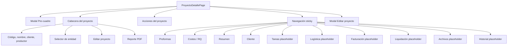

# Plan de Refactor Estructural - Proyecto 360

Fecha: 22 de junio de 2026

Archivo auditado: `app/proyectos/[id]/page.tsx`

Estado: diagnóstico y propuesta. Esta entrega no modifica comportamiento, UI, consultas ni permisos.

## A. Resumen ejecutivo

Proyecto 360 funciona actualmente como página, controlador de datos, orquestador de flujos y conjunto de vistas en un único archivo de 1,480 líneas.

Inventario técnico:

| Indicador | Cantidad |
|---|---:|
| Estados React locales (`useState`) | 21 |
| Efectos | 1 |
| Llamadas Supabase `.from()` | 40 |
| Operaciones `await` | 51 |
| Tablas Supabase referenciadas | 12 |
| Diálogos `alert` / `confirm` | 15 |
| Secciones navegables | 10 |
| Modales | 2 |

La división es viable, pero no debe comenzar trasladando lógica de negocio. La estrategia más segura es:

1. Definir tipos y contratos.
2. Extraer componentes de presentación sin mover queries.
3. Extraer cálculos derivados puros.
4. Separar estado local de los modales.
5. Recién después encapsular cargas y mutaciones en hooks.

La unidad de mayor riesgo es el flujo “iniciar proyecto / pre-cuadre / generar RQ”, porque combina cotizaciones, proveedores, subítems, RQ, proyecto, trazabilidad y notificaciones.

## B. Mapa completo de secciones

### B.1 Estructura general del archivo

| Rango aproximado | Responsabilidad |
|---|---|
| 1-42 | Imports y constantes de estados |
| 44-69 | Contexto de ruta y estado React |
| 71-142 | Carga principal de Proyecto 360 |
| 144-175 | Edición de datos base |
| 177-221 | Aprobación de cotización por cliente |
| 223-311 | Avance de estado y creación de liquidación |
| 313-439 | Pre-cuadre y generación de RQ |
| 440-464 | Rechazo, entidad y recuperación de versiones |
| 466-551 | Biblioteca y creación/copia de cotizaciones |
| 553-605 | Selectores y cálculos derivados |
| 611-733 | Modal de pre-cuadre |
| 734-812 | Cabecera y acciones globales |
| 814-828 | Navegación sticky |
| 830-1001 | Proformas |
| 1004-1128 | Costos / RQ |
| 1131-1285 | Resumen |
| 1288-1352 | Cliente |
| 1354-1426 | Secciones placeholder |
| 1428-1475 | Modal de edición |

### B.2 Árbol visual actual



### B.3 Modal Pre-cuadre

Ubicación: líneas 611-733.

Responsabilidades:

- Mostrar ítems de cotización y subítems.
- Editar costo final.
- Seleccionar proveedor.
- Elegir tipo y días de pago.
- Dividir un ítem en adelanto/saldo.
- Marcar y restaurar eliminación local.
- Agregar ítems imprevistos.
- Confirmar generación de RQ.

Dependencias:

- `preCuadreItems`
- `proveedores`
- `guardandoPreCuadre`
- `confirmarPreCuadre`
- setters de edición de filas

Observación: es el candidato visual más claro, pero su estado de edición debería viajar con el modal antes de intentar mover la mutación financiera.

### B.4 Cabecera

Ubicación: líneas 734-780.

Contenido:

- Breadcrumb.
- Código y nombre.
- Cliente y productor.
- Indicador de cotización aprobada.
- Edición de entidad.
- Botón Editar.
- Reporte PDF.

Dependencias:

- `proyecto`
- `cotAprobada`
- `editandoEntidad`
- `puedeEditar`
- `cambiarEntidad`
- `abrirEditar`

### B.5 Acciones del proyecto

Ubicación: líneas 782-812.

Acciones:

- Crear/copiar proforma.
- Crear RQ.
- Crear tarea.
- Solicitar audiovisual.
- Emitir factura.
- Ver liquidación.
- Ver documentos.

Riesgo local: la versión a copiar se obtiene mediante `document.getElementById`, lo cual acopla esta barra con el selector de Proformas.

### B.6 Navegación sticky

Ubicación: líneas 814-828.

Contenido:

- Diez enlaces por ancla.
- Contadores de cotizaciones, RQ, cliente e historial.

Dependencias:

- `tabsProyecto360`
- cálculos de conteos

### B.7 Proformas

Ubicación: líneas 830-1001.

Subsecciones:

1. Encabezado y selector de copia.
2. Versiones eliminadas recuperables.
3. Tabla de versiones.
4. Cambio de estado.
5. Editar y preview.
6. Aprobación por cliente.
7. Eliminación lógica.
8. Historial resumido por cotización.

Dependencias críticas:

- `cotizaciones`
- `cotizacionesEliminadas`
- `historial`
- `proyecto.cotizacion_aprobada_id`
- `puedeAprobarCliente`
- `nuevaVersion`
- `marcarCotizacionAprobadaCliente`
- `eliminarVersion`
- `recuperarVersion`
- `load`

### B.8 Costos / RQ

Ubicación: líneas 1004-1128.

Subsecciones:

1. Resumen de versión aprobada.
2. Disponibilidad del pre-cuadre.
3. Conteo y total de RQ.
4. Acción de RQ adicional.
5. Tabla de RQ vinculados.

Dependencias:

- `cotAprobada`
- `rqsProyecto`
- `rqsPendientes`
- `rqsPagados`
- `totalRqs`
- `totalRqsPendientes`
- `perfil`
- modal de pre-cuadre
- `rqCodigo`, `rqIgvDetalle`, `rqTratamientoIgvLabel`

### B.9 Resumen

Ubicación: líneas 1131-1285.

Subsecciones:

1. Datos base.
2. Breadcrumb de estados.
3. Regresión manual de estado.
4. Selección de versión.
5. Siguiente acción.
6. Rechazo.
7. Información económica.
8. Alertas simples.

Dependencias críticas:

- `FLUJO`
- `FLUJO_BREADCRUMB`
- `perfil`
- `proyecto`
- `versionAprobar`
- `cambiarEstado`
- `rechazar`
- consulta inline de RQ pendientes para regresar estado

### B.10 Cliente

Ubicación: líneas 1288-1352.

Contenido:

- Ficha rápida.
- Contacto.
- Productor/responsable.
- Accesos a ficha, edición, proyectos y nuevo proyecto.
- Resumen del proyecto actual.

Dependencias:

- relación `proyecto.cliente`
- `clienteId`
- `productorNombre`
- `estadoInfo`
- `router`

### B.11 Secciones placeholder

| Sección | Líneas | Estado actual |
|---|---:|---|
| Tareas | 1354-1367 | Placeholder con accesos |
| Logística | 1369-1378 | Placeholder |
| Facturación | 1380-1390 | Placeholder con acceso |
| Liquidación | 1392-1402 | Placeholder con acceso |
| Archivos | 1404-1414 | Placeholder y PDF |
| Historial | 1416-1426 | Placeholder; historial real permanece en proformas |

Estas secciones son candidatas de extracción de riesgo bajo porque no tienen consultas propias ni estado complejo.

### B.12 Modal Editar proyecto

Ubicación: líneas 1428-1475.

Campos:

- Nombre.
- Cliente.
- Productor.
- Fecha de inicio.
- Fecha fin estimada.
- Presupuesto referencial.

Dependencias:

- `formEditar`
- `clientes`
- `productores`
- `guardarEdicion`
- `showEditar`

## C. Componentes candidatos

### C.1 Estructura de carpetas propuesta

```text
components/proyectos/proyecto360/
  Project360Header.tsx
  Project360ActionBar.tsx
  Project360Nav.tsx
  ProjectSummarySection.tsx
  ProjectClientSection.tsx
  ProjectQuotesSection.tsx
  ProjectCostsRqSection.tsx
  ProjectPlaceholderSection.tsx
  ProjectEditModal.tsx
  ProjectPreSettlementModal.tsx
  ProjectWorkflowCard.tsx
  ProjectAlerts.tsx
  QuoteVersionsTable.tsx
  DeletedQuoteVersions.tsx
  ProjectRqTable.tsx
  types.ts
```

No se recomienda crear todos los archivos en una sola entrega. La estructura indica límites de responsabilidad, no una obligación de fragmentación máxima.

### C.2 Matriz de candidatos

| Componente | Responsabilidad | Props principales | Riesgo |
|---|---|---|---|
| `Project360Header` | Identidad, entidad, edición y PDF | proyecto, cotAprobada, permisos, callbacks | Bajo |
| `Project360ActionBar` | Accesos a módulos y nueva proforma | projectId, creando, quotes, callback | Bajo/medio |
| `Project360Nav` | Enlaces y contadores | tabs | Bajo |
| `ProjectQuotesSection` | Orquestar el bloque Proformas | quotes, deleted, history, permissions, callbacks | Medio |
| `DeletedQuoteVersions` | Recuperables de 48 horas | quotes, onRestore | Bajo |
| `QuoteVersionsTable` | Tabla y acciones por versión | quotes, project, history, permissions, callbacks | Medio |
| `ProjectCostsRqSection` | KPIs y tabla RQ | project, approvedQuote, rqs, profile, callbacks | Medio |
| `ProjectRqTable` | Presentación de RQ | rqs, projectId, formatter | Bajo |
| `ProjectSummarySection` | Datos, workflow, economía, alertas | view model + callbacks | Medio/alto |
| `ProjectWorkflowCard` | Estados, avance, regreso y rechazo | workflow model, permissions, callbacks | Alto |
| `ProjectClientSection` | Ficha y accesos del cliente | client view model, project, callbacks | Bajo |
| `ProjectPlaceholderSection` | Reutilizar estructura de placeholders | id, title, actions, description | Bajo |
| `ProjectPreSettlementModal` | Edición del pre-cuadre | items, providers, saving, callbacks | Medio |
| `ProjectEditModal` | Formulario de proyecto | form, options, callbacks | Bajo |
| `ProjectAlerts` | Alertas derivadas | alerts | Bajo |

### C.3 Orden recomendado de extracción

1. `ProjectPlaceholderSection`
2. `Project360Nav`
3. `ProjectClientSection`
4. `Project360Header`
5. `ProjectEditModal`
6. `ProjectRqTable`
7. `DeletedQuoteVersions`
8. `QuoteVersionsTable`
9. `ProjectQuotesSection`
10. `ProjectCostsRqSection`
11. `ProjectAlerts`
12. `ProjectPreSettlementModal`
13. `ProjectWorkflowCard`
14. `ProjectSummarySection`

El workflow queda al final porque contiene cambios de estado, regresión y efectos sobre RQ.

## D. Hooks candidatos

### D.1 `useProject360Data(projectId)`

Responsabilidad futura:

- Autenticación/perfil.
- Proyecto y relaciones.
- Cotizaciones activas.
- Historial de cotizaciones.
- RQ relacionados.
- Cotizaciones eliminadas recuperables.
- Función `reload`.

Retorno sugerido:

```ts
{
  project,
  quotes,
  deletedQuotes,
  quoteHistory,
  paymentRequests,
  profile,
  loading,
  errors,
  reload
}
```

Riesgo: el `load()` actual tiene carga secuencial y lógica especial de RQ por proyectos con el mismo código. El primer movimiento debe copiar exactamente el orden y condiciones; no optimizar simultáneamente.

### D.2 `useProject360Permissions`

Entradas:

- perfil.
- estado del proyecto.
- configuración `FLUJO`.

Salidas:

- `canEditProject`
- `canApproveClient`
- `canAdvance`
- `canReject`
- `canCreateAdditionalRq`
- `isFinalState`

Ventaja: hace visibles las reglas dispersas sin cambiar `lib/permissions.ts`.

Riesgo: no debe reemplazar los controles internos de los módulos destino.

### D.3 `useProjectEdit`

Responsabilidad:

- Apertura del modal.
- Carga de clientes/productores.
- Estado del formulario.
- Guardado.
- Cierre y refresco.

Estado que puede encapsular:

- `showEditar`
- `formEditar`
- `clientes`
- `productores`

### D.4 `useQuoteVersions`

Responsabilidad futura:

- Crear versión vacía o copiada.
- Eliminar lógicamente.
- Recuperar.
- Aprobar por cliente.
- Copiar ítems a Biblioteca.

Riesgo alto: aprobar cliente también actualiza proyecto, Gestor, historial, trazabilidad y alertas. Conviene iniciar solo con crear/eliminar/recuperar y dejar aprobación en la página.

### D.5 `useProjectWorkflow`

Responsabilidad futura:

- Avance de estado.
- Retroceso autorizado.
- Rechazo.
- Creación de liquidación al terminar.
- Bloqueo de cotización.
- Notificaciones.

Riesgo muy alto. No debe extraerse hasta contar con pruebas de transición.

### D.6 `useProjectPreSettlement`

Responsabilidad:

- Cargar ítems/subítems y proveedores.
- Administrar edición del pre-cuadre.
- Validar proveedores.
- Construir payload de RQ.
- Insertar RQ.
- Iniciar proyecto.

Separación interna recomendada:

- Hook de estado del modal.
- Funciones puras de normalización.
- Mutación/orquestación.

No se recomienda un único hook monolítico que replique las 200 líneas actuales.

### D.7 Funciones puras antes que hooks

Candidatos para `lib/project-360.ts` o módulo local:

- `buildProjectTabs`
- `getProjectAlerts`
- `getApprovedQuote`
- `getProjectPermissions`
- `groupProjectRqs`
- `calculateRqTotals`
- `normalizePreSettlementItems`
- `buildPaymentRequestPayloads`
- `formatMoney`

Las funciones financieras deben seguir usando `rqIgvDetalle`; no duplicar fórmulas.

## E. Estado compartido

### E.1 Inventario de estado

| Estado | Dominio | Consumidores | Destino recomendado |
|---|---|---|---|
| `proyecto` | Core | casi todas las secciones | Página / `useProject360Data` |
| `cotizaciones` | Proformas/workflow | Proformas, resumen, acciones | Data hook |
| `cotizacionesEliminadas` | Proformas | Proformas | Quote hook |
| `historial` | Proformas/historial | tabla, contador, nav | Data hook |
| `rqsProyecto` | Costos/resumen | Costos/RQ, métricas | Data hook |
| `perfil` | Seguridad | todas las acciones | Data/access hook |
| `loading` | Página | retorno inicial | Data hook |
| `creando` | Proformas | dos botones | Quote hook |
| `cambiando` | Workflow | resumen/acciones | Workflow hook |
| `showPreCuadre` | Modal | modal y acciones | Pre-cuadre hook |
| `preCuadreItems` | Modal/RQ | modal y confirmación | Pre-cuadre hook |
| `proveedores` | Modal/RQ | selector y payload | Pre-cuadre hook |
| `guardandoPreCuadre` | Modal/RQ | botón y mutación | Pre-cuadre hook |
| `versionAprobar` | Workflow/proformas | resumen y pre-cuadre | Página o workflow |
| `editandoEntidad` | Cabecera | header | Header local |
| `showVersionesEliminadas` | Proformas | recuperables | Proformas local |
| `showEditar` | Edición | modal | Edit hook |
| `clientes` | Edición | modal | Edit hook |
| `productores` | Edición | modal | Edit hook |
| `formEditar` | Edición | modal | Edit hook |

Nota: el conteo de 21 `useState` incluye el patrón textual del archivo; la tabla agrupa 20 dominios explícitos de estado de página.

### E.2 Estado que debe permanecer arriba inicialmente

- Proyecto.
- Perfil.
- Cotizaciones.
- RQ.
- Historial.
- Versión seleccionada.
- Función de recarga.

Estos datos cruzan varias secciones y moverlos prematuramente generaría prop drilling inverso o estados duplicados.

### E.3 Estado que puede hacerse local pronto

- Apertura del bloque de versiones eliminadas.
- Edición de entidad.
- Formularios/modales.
- Edición de filas del pre-cuadre.

### E.4 Context API

No se recomienda introducir `Project360Context` en la primera fase.

Razones:

- La jerarquía no es profundamente anidada.
- Los contratos de props todavía no están estabilizados.
- Un contexto amplio ocultaría dependencias críticas.
- Puede causar rerenders de todas las secciones con cada edición del modal.

Evaluar contexto solo después de extraer componentes y medir prop drilling real.

## F. Dependencias críticas

### F.1 Tablas Supabase

1. `proyectos`
2. `clientes`
3. `perfiles`
4. `cotizaciones`
5. `cotizacion_historial`
6. `cotizacion_items`
7. `cotizacion_subitems`
8. `proveedores`
9. `requerimientos_pago`
10. `liquidaciones`
11. `liquidacion_items`
12. `items_biblioteca`

### F.2 Helpers y servicios

| Dependencia | Uso crítico |
|---|---|
| `registrarAccion` | Trazabilidad de proyectos/cotizaciones |
| `registrarHistorial` | Historial de aprobación de proforma |
| `enviarAlerta` | Aviso de cotización aprobada |
| `notificarATodos` | Cambios de estado e inicio |
| `cargarItemsAprobadosAlGestor` | Sincronización con Gestor |
| `rqCodigo` | Identificación visual del RQ |
| `rqIgvDetalle` | Total RQ con tratamiento de IGV |
| `rqTratamientoIgvLabel` | Etiqueta financiera del RQ |
| `useRouter` | Navegación y redirección |

### F.3 Flujos transaccionales no atómicos

#### Aprobar cotización por cliente

1. Cambiar otras cotizaciones aprobadas a enviadas.
2. Aprobar y bloquear la seleccionada.
3. Actualizar cotización aprobada del proyecto.
4. Cargar ítems al Gestor.
5. Registrar historial.
6. Registrar trazabilidad.
7. Enviar alerta.
8. Recargar.

Si un paso intermedio falla, puede quedar un estado parcial.

#### Iniciar proyecto y generar RQ

1. Validar cotización aprobada.
2. Cargar ítems/subítems.
3. Ajustar costos y proveedores.
4. Construir RQ.
5. Insertar RQ.
6. Validar códigos generados.
7. Actualizar proyecto a `en_curso`.
8. Registrar acción.
9. Notificar.
10. Recargar.

Esta secuencia no debe dividirse entre varios componentes con mutaciones independientes.

#### Terminar proyecto

1. Buscar liquidación.
2. Crearla si no existe.
3. Copiar ítems de cotización.
4. Cambiar estado.
5. Registrar acción.
6. Notificar.

#### Regresar estado

1. Validar rol y dirección.
2. Consultar RQ pendientes.
3. Confirmar.
4. Rechazar RQ.
5. Cambiar estado del proyecto.

### F.4 Acoplamientos invisibles

- `versionAprobar` conecta Proformas, Resumen, Pre-cuadre y Workflow.
- El selector `copiar-version` se consulta con DOM directo desde dos botones.
- `load()` se usa como mecanismo general de consistencia tras mutaciones.
- `proyecto.estado` decide permisos, modal, alertas y acciones.
- El código de proyecto amplía la carga de RQ a otros IDs con el mismo código.
- `cancelado` se presenta visualmente como “Pagado”.
- El historial consolidado aún es placeholder; el dato real vive por cotización.

## G. Riesgos de refactor

### G.1 Matriz

| ID | Riesgo | Severidad | Mitigación |
|---|---|---|---|
| P360-01 | Cambiar orden de queries y alterar selección de versión | Alta | Pruebas de carga con varias cotizaciones |
| P360-02 | Duplicar o perder RQ al extraer pre-cuadre | Crítica | Mantener una sola función orquestadora |
| P360-03 | Proyecto en curso sin RQ por fallo parcial | Crítica | No separar inserción/actualización en callbacks UI |
| P360-04 | Aprobación de cliente sin Gestor/historial/alerta | Alta | Pruebas por paso y resultado parcial |
| P360-05 | Crear liquidación duplicada | Alta | Conservar consulta previa y validar concurrencia |
| P360-06 | Regresión de permisos | Crítica | Congelar matriz de roles y pruebas por transición |
| P360-07 | Estado React duplicado entre página y hook | Alta | Una sola fuente de verdad por dominio |
| P360-08 | Rerenders amplios por contexto global | Media | Props explícitas antes de Context |
| P360-09 | Diferencias visuales por mover estilos inline | Media | Copiar markup/estilos sin reinterpretarlos |
| P360-10 | Cambiar fórmula de RQ/IGV | Crítica | Reutilizar helpers existentes |
| P360-11 | Perder RQ asociados por código compartido | Alta | Test del fallback por código |
| P360-12 | Romper anclas y posición sticky | Media | Mantener IDs y `scrollMarginTop` |
| P360-13 | Cambiar recuperación de 48 horas | Media | Conservar cálculo y filtro temporal |
| P360-14 | Desincronizar botones duplicados de crear versión | Media | Un callback y estado controlado |
| P360-15 | Optimización simultánea oculta regresiones | Alta | Refactor estructural sin cambiar queries |

### G.2 Cambios que no deben combinarse con la extracción

- Paralelizar consultas.
- Sustituir `any` masivamente.
- Cambiar nombres de estados.
- Centralizar permisos globales.
- Rediseñar tabs.
- Implementar placeholders.
- Cambiar alerts por toasts.
- Añadir gestión de caché.
- Introducir React Query/SWR.
- Convertir la página completa a Server Components.
- Crear RPC transaccionales.

Todos pueden ser mejoras válidas, pero deben ocurrir en entregas separadas.

## H. Plan por fases

### Fase 0 - Línea base

- Capturas desktop y móvil.
- Registrar HTML/orden de secciones.
- Casos de prueba por rol.
- Proyecto con varias proformas, RQ y liquidación.
- `npm run build`.

### Fase 1 - Tipos y view models

- Crear tipos locales sin alterar consultas.
- Tipar props de componentes nuevos.
- Crear selectores puros para datos derivados.
- Mantener el estado y mutaciones en `page.tsx`.

Objetivo: reducir ambigüedad sin cambiar ejecución.

### Fase 2 - Componentes de bajo riesgo

- Placeholders.
- Navegación.
- Cliente.
- Cabecera.
- Modal de edición.

Validación: comparación visual pixel a pixel y navegación.

### Fase 3 - Tablas de lectura

- Tabla RQ.
- Versiones eliminadas.
- Tabla de cotizaciones.
- Alertas.

Las acciones siguen llegando por callbacks desde la página.

### Fase 4 - Secciones contenedoras

- Proformas.
- Costos/RQ.
- Resumen.

La página conserva queries, permisos y mutaciones.

### Fase 5 - Estado local de modales

- `useProjectEdit`.
- Estado de presentación del pre-cuadre.
- Reducer local para edición de filas.

La confirmación de RQ todavía permanece arriba.

### Fase 6 - Data hook

- Extraer `load()` sin optimizarlo.
- Exponer errores por fuente.
- Mantener exactamente los filtros y fallback por código.

### Fase 7 - Mutaciones de menor riesgo

- Editar proyecto.
- Cambiar entidad.
- Crear/eliminar/recuperar cotización.

### Fase 8 - Orquestaciones críticas

- Aprobar cliente.
- Workflow.
- Pre-cuadre/RQ.
- Creación de liquidación.

Requiere pruebas automatizadas o una matriz manual exhaustiva.

## I. Contrato sugerido de la página final

```tsx
export default function ProyectoDetallePage() {
  const data = useProject360Data(projectId)
  const permissions = useProject360Permissions(data.project, data.profile)

  return (
    <Project360Page>
      <Project360Header />
      <Project360ActionBar />
      <Project360Nav />
      <ProjectQuotesSection />
      <ProjectCostsRqSection />
      <ProjectSummarySection />
      <ProjectClientSection />
      <ProjectOperationalPlaceholders />
      <ProjectEditModal />
      <ProjectPreSettlementModal />
    </Project360Page>
  )
}
```

Este ejemplo describe responsabilidades. No implica introducir un layout nuevo ni cambiar el DOM visible.

## J. Validaciones obligatorias para el refactor futuro

### Carga

- Proyecto activo abre.
- Proyecto eliminado redirige.
- Perfil se carga.
- Cotizaciones activas y eliminadas aparecen.
- Historial se conserva.
- RQ por ID y por código se deduplican.

### Proformas

- Crear vacía.
- Copiar versión.
- Editar.
- Preview.
- Cambiar estado.
- Aprobar por cliente.
- Eliminar y recuperar.

### Workflow

- Cada rol ve las mismas acciones.
- No se avanza sin cotización aprobada.
- Regresar estado rechaza los RQ indicados.
- Terminar crea una sola liquidación.
- Rechazar conserva comportamiento.

### Pre-cuadre

- Carga ítems y subítems.
- Excluye celdas extra/familias según regla.
- Exige proveedor.
- Divide adelanto/saldo.
- Agrega imprevistos.
- Genera códigos RQ.
- No cambia proyecto si falla la creación.

### UI

- Mismos textos.
- Mismos estilos y colores.
- Mismo orden de secciones.
- Mismos IDs de ancla.
- Mismo sticky offset.
- Mismos estados vacíos y modales.

### Técnica

- `npm run build`.
- TypeScript.
- Diff sin cambios de queries/permisos/fórmulas durante fases visuales.

## K. Criterio de éxito

El refactor será exitoso cuando:

- `page.tsx` actúe como composición y orquestación.
- Cada sección tenga una responsabilidad clara.
- No existan estados duplicados.
- Las mutaciones críticas permanezcan centralizadas o tengan pruebas.
- UI, permisos, queries y resultados sean idénticos.
- El usuario no perciba cambio funcional.

## L. Alcance de esta entrega

| Validación | Resultado |
|---|---|
| Código funcional modificado | No |
| UI modificada | No |
| Queries modificadas | No |
| Permisos modificados | No |
| Documento creado | Sí |
