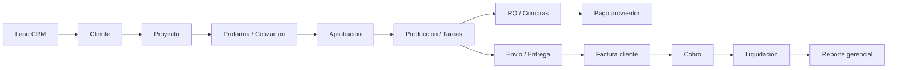
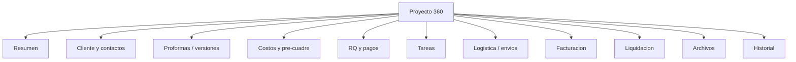

# Auditoria UX y arquitectura de navegacion

Fecha: 2026-06-07

Alcance: navegacion completa del ERP Izango, con foco en CRM, Clientes, Proyectos, Proformas, Tareas, Compras, RQ, RRHH, Facturacion y Reportes.

Restriccion aplicada: no se modifico codigo funcional. Este documento es una propuesta de arquitectura de informacion y roadmap UX.

## Resumen ejecutivo

El ERP ya cubre la operacion principal de una agencia BTL, pero la navegacion crecio como una lista plana de modulos. Esto hace que algunos flujos naturales del negocio queden fragmentados entre varias pantallas.

Los principales problemas son:

- Proyectos, proformas, RQ, facturacion y liquidaciones forman un mismo ciclo operativo-financiero, pero viven como accesos separados.
- CRM y Clientes estan separados sin una transicion clara de lead a cuenta activa.
- Compras esta distribuido entre Proveedores, RQ, Inventario, Ordenes y Envios de materiales.
- RRHH tiene demasiadas entradas laterales para procesos que podrian organizarse bajo un hub.
- Reporteria existe como modulo, pero el dashboard tambien funciona como reporte ejecutivo; ambos necesitan roles y propositos mas claros.

Recomendacion: migrar hacia una navegacion por ciclos de trabajo, no por tablas. El sidebar deberia priorizar "Operacion", "Comercial", "Finanzas", "Compras/Logistica", "Personas", "Reportes" y "Administracion".

## Mapa actual

### Rutas principales detectadas

```mermaid
flowchart TD
  App["ERP"]
  App --> Principal["Principal"]
  Principal --> Dashboard["/dashboard"]
  Principal --> Proyectos["/proyectos"]
  Principal --> Calendario["/calendario"]
  Principal --> Gestor["/gestor"]
  Principal --> Tareas["/tareas"]
  Principal --> Clientes["/clientes"]
  Principal --> CRM["/crm"]

  App --> Comercial["Comercial"]
  Comercial --> Proformas["/proformas"]
  Comercial --> Proveedores["/proveedores"]
  Comercial --> Biblioteca["/biblioteca"]

  App --> Finanzas["Finanzas"]
  Finanzas --> RQ["/rq"]
  Finanzas --> Facturacion["/facturacion"]
  Finanzas --> Liquidaciones["/liquidaciones"]
  Finanzas --> Conciliacion["/conciliacion"]
  Finanzas --> FlujoCaja["/flujo-caja"]
  Finanzas --> CentroCostos["/centro-costos"]
  Finanzas --> CajaChica["/caja-chica"]
  Finanzas --> GastosOficina["/gastos-oficina"]
  Finanzas --> Prestamos["/prestamos"]

  App --> Operaciones["Operaciones"]
  Operaciones --> Inventario["/inventario"]
  Operaciones --> Ordenes["/inventario/ordenes"]
  Operaciones --> Ubicaciones["/inventario/ubicaciones"]
  Operaciones --> Envios["/envios-materiales"]

  App --> RRHH["RRHH"]
  RRHH --> Trabajadores["/rrhh/trabajadores"]
  RRHH --> Planilla["/rrhh/planilla"]
  RRHH --> HorasExtras["/rrhh/horas-extras"]
  RRHH --> Vacaciones["/rrhh/vacaciones"]
  RRHH --> Permisos["/rrhh/permisos"]
  RRHH --> Faltas["/rrhh/faltas-medicas"]

  App --> Admin["Administracion"]
  Admin --> Reporteria["/reporteria"]
  Admin --> Trazabilidad["/trazabilidad"]
  Admin --> Alertas["/alertas"]
  Admin --> Usuarios["/admin/usuarios"]

  App --> IA["/ia"]
  App --> Perfil["/perfil"]
```

### Sidebar actual

| Seccion actual | Items | Observacion UX |
|---|---:|---|
| Principal | 7 | Mezcla tableros, operacion, tareas, clientes y CRM. |
| Comercial | 3 | "Proformas" funciona mas como vista global de cotizaciones de proyectos. |
| Finanzas | 9 | Es la seccion mas larga; combina pagos, cobros, caja y control financiero. |
| Operaciones | 4 | Inventario, ordenes y envios estan relacionados, pero compras queda fuera. |
| IA | 1 | Seccion aislada con un solo item. |
| RRHH | 6 | Demasiados accesos laterales para tramites internos. |
| Administracion | 4 | Reporteria queda mezclada con auditoria, alertas y usuarios. |
| Mi cuenta | 1 | Correcto, aunque podria ir en menu de usuario. |

## Problemas detectados

### 1. Navegacion plana y alta carga cognitiva

El usuario ve muchos destinos de primer nivel. Para perfiles operativos, esto obliga a recordar si una accion pertenece a Proyectos, Proformas, RQ, Facturacion o Liquidaciones.

Impacto: descubribilidad media-baja para usuarios nuevos y mayor dependencia de entrenamiento interno.

### 2. Modulos duplicados o fragmentados

| Area | Fragmentacion detectada | Riesgo |
|---|---|---|
| Proformas | Existe `/proformas`, pero la edicion real vive en `/proyectos/[id]/cotizaciones/[cotId]`. | El usuario puede ver proformas globales, pero no entiende que son hijas del proyecto. |
| Envios de materiales | Existen carpetas `envio-materiales` y `envios-materiales` con pantallas equivalentes. | Duplicidad de mantenimiento y confusion de URLs. |
| Compras | Proveedores, RQ, Inventario, Ordenes y Envios estan separados. | El flujo de compra no se entiende de punta a punta. |
| Clientes/CRM | CRM convierte leads a clientes, pero Clientes es otro modulo independiente. | La relacion lead -> cliente -> proyecto no es evidente. |
| Reportes/Dashboard | Dashboard muestra KPIs ejecutivos y Reporteria muestra datasets exportables. | Sin nombres claros, ambos compiten como "lugar para ver informacion". |
| Gestor/Tareas/Calendario | Tres entradas relacionadas con ejecucion diaria. | El productor puede saltar entre vistas sin un centro operativo claro. |

### 3. Flujos con exceso de clics

| Flujo | Camino probable actual | Friccion |
|---|---|---|
| Crear proforma para un proyecto | Proyectos -> Ver proyecto -> Nueva proforma -> Editor -> Preview | Correcto en jerarquia, pero no hay CTA contextual desde Cliente/CRM. |
| Convertir lead en proyecto | CRM -> convertir a cliente -> Clientes/Proyectos -> Nuevo proyecto | Falta siguiente accion guiada despues de convertir. |
| Crear RQ desde una necesidad operativa | Proyectos o RQ -> Nuevo RQ -> seleccionar proyecto/proveedor | La accion existe, pero compras no tiene hub con pendientes. |
| Facturar proyecto aprobado | Proyectos/Liquidaciones -> Facturacion -> Nueva factura -> seleccionar proyecto | La factura no parece nacer desde el proyecto o hito facturable. |
| Revisar estado integral de proyecto | Proyectos -> detalle -> proformas/RQ/reporte; luego Finanzas para facturas/liquidaciones | Falta una vista 360 del proyecto con pestañas por ciclo. |
| Gestionar RRHH personal | RRHH -> trabajador/vacaciones/permisos/horas/faltas | Las solicitudes personales y gestion administrativa comparten el mismo nivel. |

### 4. Problemas de descubribilidad

- "Req. de pago" usa abreviatura interna; conviene "Requerimientos de pago" o "Pagos a proveedores".
- "Gestor de proyectos" compite con "Proyectos" y "Tareas".
- "Biblioteca" no explica si es biblioteca de costos, itemizado, materiales o plantillas.
- "Centro de costos" puede solaparse mentalmente con Proyectos y Liquidaciones.
- "Reporteria" esta en Administracion, aunque probablemente la usan gerencia, finanzas y operaciones.

### 5. Problemas de consistencia

- Algunas pantallas usan paginas dedicadas para crear (`/clientes/nuevo`, `/proyectos/nuevo`), otras modales (`CRM`, `RQ`, `Facturacion`, `RRHH`, `Inventario`).
- CTAs principales alternan entre "+ Nuevo", "+ Registrar", "+ Manual", "+ Crear mi ficha".
- Algunos flujos usan breadcrumbs y otros no.
- La navegacion secundaria dentro de modulos no esta estandarizada con tabs.

## Analisis por modulo

### CRM

Fortalezas:

- Tiene flujo de alta/edicion de lead.
- Permite convertir lead a cliente.
- Usa detalle lateral/modal para notas y seguimiento.

Problemas:

- Despues de convertir a cliente, falta CTA siguiente: "Crear proyecto", "Ver cliente", "Agendar seguimiento".
- No se observa integracion clara con pipeline comercial, proformas o forecast.
- "CRM" y "Clientes" estan al mismo nivel, aunque Clientes deberia ser una etapa posterior del ciclo comercial.

Quick wins:

- Renombrar seccion a "Comercial" y agrupar `CRM`, `Clientes`, `Proformas`.
- Agregar accion contextual post-conversion: "Crear proyecto para este cliente".
- Mostrar contador de leads calientes en dashboard/sidebar.

### Clientes

Fortalezas:

- Tiene listado, alta, edicion y contactos.
- Captura datos administrativos y bancarios.

Problemas:

- El formulario de cliente es largo y mezcla datos comerciales, contactos, pagos y bancos.
- El cliente no funciona como hub: desde su detalle no queda visible el historial de proyectos, proformas, facturas y contactos.

Quick wins:

- Convertir detalle de cliente en tabs: Resumen, Contactos, Proyectos, Finanzas, Datos administrativos.
- Separar "Nuevo cliente" en secciones colapsables o pasos cortos.

### Proyectos

Fortalezas:

- Es el nucleo del ERP.
- El detalle concentra proformas, pre-cuadre, reportes y cambio de estados.

Problemas:

- Hay demasiadas responsabilidades en una sola pagina de detalle.
- La relacion con RQ, facturacion, liquidacion y tareas podria ser mas visible como tabs.
- "Gestor de proyectos" puede fragmentar la experiencia de proyectos.

Quick wins:

- Usar una estructura de tabs en el proyecto: Resumen, Proformas, Costos/RQ, Tareas, Facturacion, Liquidacion, Archivos, Historial.
- Mantener "Nuevo proyecto" como entrada primaria desde Proyectos, CRM y Cliente.

### Proformas

Fortalezas:

- Existe una vista global para buscar, filtrar y entrar al editor/preview.
- El editor vive bajo el proyecto, lo cual es correcto como modelo.

Problemas:

- El nombre "Proformas" como modulo global puede ocultar que son cotizaciones/versiones de un proyecto.
- No hay distincion evidente entre pipeline comercial y versiones aprobadas.

Quick wins:

- Renombrar a "Cotizaciones/Proformas" si negocio usa ambos terminos.
- En el sidebar, ubicarlo bajo Comercial, pero mantener creacion contextual desde Proyecto.

### Tareas

Fortalezas:

- Existe modulo dedicado de tareas con creacion y detalle.
- Puede vincular proyectos/clientes.

Problemas:

- Compite con Calendario y Gestor de proyectos.
- Falta un "Mi trabajo" como vista personal priorizada por fecha, estado y responsable.

Quick wins:

- Renombrar a "Mi trabajo" o agrupar Tareas + Calendario bajo "Trabajo".
- Mostrar tareas del proyecto dentro del detalle de proyecto.

### Compras / Logistica

Fortalezas:

- Hay proveedores, RQ, inventario, ordenes y envios.
- RQ incluye estados de aprobacion y datos de pago.

Problemas:

- No existe un hub de compras.
- Proveedores esta en Comercial, aunque operativamente pertenece a Compras/Logistica.
- RQ esta en Finanzas, pero tambien es el inicio de compras/pago a proveedor.
- Envios de materiales esta duplicado como ruta singular y plural.

Quick wins:

- Crear agrupacion "Compras y logistica": Proveedores, Requerimientos de pago, Inventario, Ordenes, Envios.
- Mantener accesos financieros a RQ desde Finanzas mediante filtros "Por pagar" o "Pagos".
- Consolidar la ruta duplicada de envios cuando se haga implementacion.

### RQ

Fortalezas:

- Tiene flujo de aprobacion, rechazo, pago y trazabilidad.
- Permite crear RQ manual.

Problemas:

- Es una entidad puente: produccion la solicita, gerencia aprueba, finanzas paga. Un solo lugar plano no diferencia esas bandejas.
- La creacion manual pide seleccionar proyecto y proveedor, lo que puede sentirse repetitivo si se viene desde un proyecto.

Quick wins:

- Separar vistas por bandeja: Solicitudes, Aprobaciones, Programacion de pago, Pagados.
- Desde proyecto, prellenar proyecto/proveedor cuando el RQ nace de un item de costo.

### RRHH

Fortalezas:

- Cubre trabajadores, planilla, horas extras, vacaciones, permisos y faltas.
- Hay distincion parcial entre auto-ficha y gestion.

Problemas:

- Muchos tramites aparecen como items de primer nivel.
- Solicitudes personales y administracion RRHH conviven sin separacion clara.

Quick wins:

- Crear hub "Personas" con dos subgrupos: Mi gestion y Administracion RRHH.
- Para usuarios no RRHH, mostrar solo Mis solicitudes, Vacaciones, Permisos, Horas extras.

### Facturacion

Fortalezas:

- Permite crear factura, listar estados y ver links de reporte.
- Esta conectada con proyectos.

Problemas:

- Crear factura desde una pantalla global obliga a recordar el proyecto.
- Podria existir una bandeja "Listo para facturar" basada en estado del proyecto/proforma.

Quick wins:

- Agregar acceso contextual desde proyecto: "Emitir factura".
- Separar facturas por estado: Por emitir, Emitidas, Cobradas, Anuladas.

### Reportes

Fortalezas:

- Existe un modulo dedicado de reporterias con datasets.
- El dashboard ya presenta KPIs utiles.

Problemas:

- Reporteria esta dentro de Administracion, aunque no es solo administrativo.
- Falta taxonomia por audiencia: gerencia, finanzas, operaciones, comercial, RRHH.

Quick wins:

- Renombrar seccion a "Analitica y reportes".
- Separar "Dashboard ejecutivo" de "Reportes exportables".

## Mapa propuesto

### Principio de agrupacion

Agrupar por ciclo de trabajo:

1. Direccion: que necesita ver gerencia.
2. Comercial: de lead a cliente y oportunidad.
3. Operacion: de proyecto a entrega.
4. Compras y logistica: de proveedor a entrega de materiales.
5. Finanzas: de pagar/cobrar a caja.
6. Personas: tramites y administracion RRHH.
7. Analitica: reportes y trazabilidad.
8. Administracion: usuarios, permisos y configuracion.

## Nuevo sitemap ideal

```mermaid
flowchart TD
  Root["ERP Izango"]

  Root --> Inicio["Inicio"]
  Inicio --> DashboardEjecutivo["Dashboard ejecutivo"]
  Inicio --> MiTrabajo["Mi trabajo"]
  Inicio --> Calendario["Calendario"]
  Inicio --> Alertas["Alertas"]

  Root --> Comercial["Comercial"]
  Comercial --> CRM["CRM / Leads"]
  Comercial --> Clientes["Clientes"]
  Comercial --> Cotizaciones["Cotizaciones y proformas"]
  Comercial --> BibliotecaCostos["Biblioteca de costos"]

  Root --> Operacion["Operacion"]
  Operacion --> Proyectos["Proyectos"]
  Proyectos --> DetalleProyecto["Detalle 360"]
  DetalleProyecto --> Resumen["Resumen"]
  DetalleProyecto --> ProformasTab["Proformas"]
  DetalleProyecto --> CostosRQ["Costos y RQ"]
  DetalleProyecto --> TareasTab["Tareas"]
  DetalleProyecto --> FacturacionTab["Facturacion"]
  DetalleProyecto --> LiquidacionTab["Liquidacion"]
  DetalleProyecto --> Archivos["Archivos"]
  DetalleProyecto --> Historial["Historial"]

  Root --> Compras["Compras y logistica"]
  Compras --> Proveedores["Proveedores"]
  Compras --> Requerimientos["Requerimientos de pago"]
  Compras --> Inventario["Inventario"]
  Compras --> Ordenes["Ordenes"]
  Compras --> Envios["Envios de materiales"]

  Root --> Finanzas["Finanzas"]
  Finanzas --> Cobranza["Facturacion y cobranza"]
  Finanzas --> Pagos["Pagos a proveedores"]
  Finanzas --> Liquidaciones["Liquidaciones"]
  Finanzas --> Caja["Caja chica"]
  Finanzas --> Flujo["Flujo de caja"]
  Finanzas --> Centros["Centros de costo"]
  Finanzas --> Conciliacion["Conciliacion"]
  Finanzas --> Gastos["Gastos y prestamos"]

  Root --> Personas["Personas"]
  Personas --> MisSolicitudes["Mis solicitudes"]
  Personas --> Trabajadores["Trabajadores"]
  Personas --> Planilla["Planilla"]
  Personas --> Asistencia["Permisos, vacaciones y horas"]
  Personas --> Faltas["Faltas medicas"]

  Root --> Analitica["Analitica"]
  Analitica --> Reportes["Reportes"]
  Analitica --> Trazabilidad["Trazabilidad"]

  Root --> Admin["Administracion"]
  Admin --> Usuarios["Usuarios"]
  Admin --> Perfil["Mi perfil"]
  Admin --> IA["Asistente IA"]
```

## Nuevo sidebar recomendado

### Version desktop

| Grupo | Items visibles | Criterio |
|---|---|---|
| Inicio | Dashboard, Mi trabajo, Calendario, Alertas | Acceso diario. |
| Comercial | CRM, Clientes, Cotizaciones, Biblioteca | Lead -> cliente -> propuesta. |
| Operacion | Proyectos, Gestor, Tareas | Ejecucion y produccion BTL. |
| Compras y logistica | Proveedores, Requerimientos, Inventario, Ordenes, Envios | Flujo proveedor/materiales. |
| Finanzas | Facturacion, Liquidaciones, Caja chica, Flujo de caja, Conciliacion, Centro de costos | Dinero, cobros, control. |
| Personas | Trabajadores, Planilla, Solicitudes, Horas extras, Vacaciones, Permisos, Faltas | RRHH con subgrupos. |
| Analitica | Reportes, Trazabilidad | Consulta y auditoria. |
| Administracion | Usuarios, Configuracion | Solo roles admin. |
| Cuenta | Mi perfil, Cerrar sesion | Accion personal. |

### Version por rol

| Rol | Sidebar prioritario |
|---|---|
| Productor | Inicio, Operacion, Compras y logistica, Mi trabajo, Personas personales. |
| Comercial | Inicio, Comercial, Proyectos, Cotizaciones, Reportes comerciales. |
| Finanzas | Inicio, Finanzas, RQ/Pagos, Facturacion, Liquidaciones, Reportes financieros. |
| RRHH | Inicio, Personas, Reportes RRHH. |
| Gerencia | Dashboard ejecutivo, Reportes, Proyectos, Finanzas, Alertas. |
| Admin | Todo + Administracion. |

## Arquitectura propuesta para proyecto 360

Beneficio: reduce saltos entre modulos y permite que cada area entre por su sidebar, pero trabaje sobre el mismo objeto central: el proyecto.

## Quick wins UX

| Prioridad | Quick win | Impacto | Riesgo |
|---|---|---|---|
| Alta | Renombrar "Req. de pago" a "Requerimientos de pago" o "Pagos a proveedores". | Mejora comprension inmediata. | Bajo |
| Alta | Agrupar Proveedores, RQ, Inventario, Ordenes y Envios bajo "Compras y logistica". | Reduce fragmentacion de compras. | Medio |
| Alta | Consolidar `envio-materiales` y `envios-materiales` en una sola ruta visible. | Elimina duplicidad. | Medio |
| Alta | Convertir Reporteria en "Analitica y reportes", fuera de Administracion. | Mejora descubribilidad gerencial. | Bajo |
| Media | Agregar tabs al detalle de proyecto. | Reduce saltos y ordena flujo central. | Medio |
| Media | Crear "Mi trabajo" como entrada unica a tareas, calendario y pendientes. | Mejora operacion diaria. | Medio |
| Media | En CRM, despues de convertir lead, ofrecer "Ver cliente" y "Crear proyecto". | Reduce clics. | Bajo |
| Media | En cliente, mostrar proyectos, proformas y facturas relacionadas. | Convierte cliente en hub comercial. | Medio |
| Baja | Unificar textos de CTA: Nuevo, Registrar, Solicitar, Emitir. | Consistencia. | Bajo |
| Baja | Estandarizar breadcrumbs en pantallas profundas. | Orientacion. | Bajo |

## Roadmap UX

### UX v1 - Ordenar sin reescribir flujos

Objetivo: mejorar descubribilidad con bajo riesgo.

- Reorganizar sidebar por grupos propuestos.
- Renombrar items ambiguos.
- Ocultar items no relevantes por rol con mejores etiquetas.
- Mover Reporteria a Analitica.
- Documentar una sola ruta canonica para Envios de materiales.
- Agregar CTAs contextuales: CRM -> Cliente -> Proyecto; Proyecto -> Proforma/RQ/Factura.

Criterio de exito:

- Menos items visibles por usuario.
- Usuarios nuevos entienden donde crear lead, proyecto, RQ y factura sin capacitacion adicional.

### UX v2 - Hubs por objeto de negocio

Objetivo: reducir clics y saltos.

- Cliente 360: datos, contactos, proyectos, facturas, notas.
- Proyecto 360 con tabs: resumen, proformas, costos/RQ, tareas, facturacion, liquidacion, archivos, historial.
- Compras hub: proveedores, solicitudes, aprobaciones, pagos, inventario y envios.
- Personas hub: mis solicitudes y gestion RRHH separadas.

Criterio de exito:

- Un productor puede operar un proyecto sin salir constantemente del detalle.
- Finanzas puede ver por pagar, por cobrar y liquidaciones desde bandejas claras.

### UX v3 - Experiencia operativa avanzada

Objetivo: convertir el ERP en sistema de trabajo diario.

- Bandejas inteligentes por rol: "Mis aprobaciones", "Por facturar", "Por pagar", "Proyectos en riesgo".
- Busqueda global accionable: crear, abrir, filtrar y navegar por entidad.
- Dashboard configurable por rol.
- Notificaciones accionables con deep links.
- Plantillas de proyecto/proforma/RQ para eventos BTL recurrentes.
- Medicion de tiempos de ciclo: lead a proyecto, proyecto a proforma, proforma a aprobacion, produccion a liquidacion.

Criterio de exito:

- Menos dependencia de reportes manuales.
- Menos seguimiento por fuera del ERP.
- Mayor trazabilidad de decisiones y aprobaciones.

## Riesgos pendientes antes de implementar

| Riesgo | Descripcion | Mitigacion |
|---|---|---|
| Permisos por rol | Reordenar sidebar puede mostrar u ocultar rutas de forma distinta. | Validar matriz de acceso antes de tocar UI. |
| Habitos de usuarios | Usuarios actuales pueden tener memoria muscular del sidebar plano. | Implementar gradualmente y comunicar cambios. |
| Duplicidad tecnica | `envio-materiales` y `envios-materiales` pueden tener links externos existentes. | Definir ruta canonica y redireccionar la otra. |
| Proyecto 360 grande | Tabs pueden ocultar informacion si no se disenan bien. | Priorizar resumen con estados, alertas y proximas acciones. |
| Reportes por rol | Reporteria puede contener datos sensibles. | Mantener control de permisos antes de expandir descubribilidad. |

## Recomendacion final

Aplicar primero UX v1. No requiere redisenar pantallas profundas y puede mejorar mucho la navegacion con bajo riesgo.

No implementar todavia un redisenio visual completo. El siguiente paso ideal es validar este sitemap con 4 perfiles reales: productor, finanzas, RRHH y gerencia. Despues de esa validacion, avanzar con Proyecto 360 y Compras hub como las dos piezas de mayor impacto operativo.
