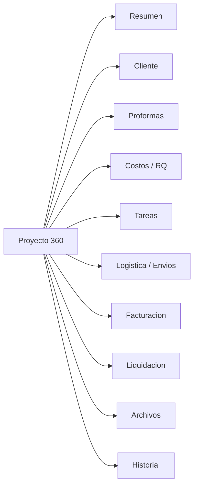

# Blueprint Proyecto 360

Fecha: 2026-06-07

Alcance: diseño de la nueva arquitectura del detalle de proyecto con tabs. No se modifica codigo funcional.

## Resumen ejecutivo

La pantalla actual de detalle de proyecto funciona como centro operativo, pero concentra demasiadas responsabilidades en una sola vista vertical: cabecera, edicion, reportes, creacion de proformas, acciones operativas, estado, aprobaciones, pre-cuadre/RQ, proformas, recuperacion de versiones y modales.

La propuesta Proyecto 360 mantiene el proyecto como objeto central, pero organiza la informacion por tabs de trabajo. El objetivo no es redisenar todo en una sola entrega, sino reducir busqueda, scroll y saltos entre modulos.

## 1. Mapa actual del detalle de proyecto

```mermaid
flowchart TD
  P["Detalle de Proyecto actual"]
  P --> ModalPre["Modal Pre-cuadre de costos"]
  P --> Header["Cabecera"]
  Header --> Breadcrumb["Breadcrumb Proyectos / codigo"]
  Header --> Title["Nombre, cliente, productor, entidad"]
  Header --> Edit["Editar proyecto"]
  Header --> PDF["Reporte PDF"]
  Header --> NewProforma["Nueva proforma / copiar version"]

  P --> Actions["Acciones del proyecto"]
  Actions --> CreateQuote["Crear proforma / cotizacion"]
  Actions --> CreateRQ["Crear RQ"]
  Actions --> CreateTask["Crear tarea"]
  Actions --> CreateInvoice["Emitir factura"]
  Actions --> ViewLiquidation["Ver liquidacion"]
  Actions --> ViewDocs["Ver documentos"]

  P --> Status["Estado y datos base"]
  Status --> CurrentState["Estado actual"]
  Status --> Dates["Fechas"]
  Status --> Budget["Presupuesto referencial"]

  P --> Workflow["Flujo de aprobacion"]
  Workflow --> ApproveVersion["Seleccionar version aprobada"]
  Workflow --> AdvanceState["Avanzar estado"]
  Workflow --> Reject["Rechazar proyecto"]
  Workflow --> RQAdditional["Generar RQs adicionales"]

  P --> DeletedQuotes["Versiones eliminadas recuperables"]
  P --> Proformas["Lista de proformas"]
  Proformas --> EditQuote["Editar"]
  Proformas --> PreviewQuote["Preview"]
  Proformas --> DeleteQuote["Eliminar"]
  Proformas --> StateQuote["Cambiar estado"]

  P --> EditModal["Modal editar proyecto"]
```

### Inventario de capacidades actuales

| Bloque actual | Contenido | Acciones principales |
|---|---|---|
| Cabecera | Codigo, nombre, cliente, productor, entidad. | Editar, Reporte PDF, Nueva proforma. |
| Acciones del proyecto | Accesos contextuales recientes. | Crear proforma, RQ, tarea, factura, liquidacion, documentos. |
| Estado | Estado, fechas, presupuesto. | Sin accion directa salvo flujo debajo. |
| Flujo | Breadcrumb de estados y aprobaciones. | Avanzar, rechazar, volver estados, seleccionar version. |
| Pre-cuadre/RQ | Modal para generar RQs adicionales. | Agregar items, proveedores, generar RQs. |
| Proformas | Versiones, subtotales, estados, historial por cotizacion. | Editar, preview, eliminar, recuperar. |
| Edicion | Modal con datos del proyecto. | Guardar cambios. |

## 2. Problemas UX actuales

| Problema | Impacto |
|---|---|
| Una sola vista vertical concentra todo. | El usuario debe hacer scroll y recordar donde vive cada accion. |
| Las acciones de negocio y las acciones administrativas compiten visualmente. | "Editar", "Reporte", "Nueva proforma", "Avanzar estado" y "Generar RQs" tienen jerarquia ambigua. |
| Proformas domina la pantalla. | Facturacion, tareas, RQ, liquidacion y documentos quedan como saltos externos. |
| Estado y aprobaciones estan mezclados con informacion base. | Gerencia/productores pueden perder contexto de que paso y que falta. |
| Cliente aparece como texto, no como contexto accionable. | Falta ver contactos, datos administrativos, proyectos previos o enlace directo al cliente. |
| RQ y costos aparecen parcialmente. | Hay generacion de RQs, pero no una vista clara de RQs existentes, pendientes y pagados del proyecto. |
| No hay separacion por rol o momento del ciclo. | Comercial, produccion, finanzas y gerencia ven la misma densidad de informacion. |
| No hay resumen ejecutivo consolidado. | Para saber salud del proyecto hay que leer varias secciones o ir a otros modulos. |

## 3. Estructura propuesta de tabs

### Orden recomendado

1. Resumen
2. Cliente
3. Proformas
4. Costos / RQ
5. Tareas
6. Logistica / Envios
7. Facturacion
8. Liquidacion
9. Archivos
10. Historial

Este orden sigue el ciclo natural BTL: contexto, cliente, propuesta, costos, ejecucion, logistica, cobro, cierre, documentos y auditoria.

## 4. Informacion por tab

### Resumen

Objetivo: responder en 30 segundos que es el proyecto, en que estado esta y que necesita atencion.

Debe mostrar:

- Codigo, nombre, cliente, productor y entidad.
- Estado actual y siguiente accion.
- Fechas clave: limite de cotizacion, inicio, fin estimada.
- Presupuesto referencial y valor aprobado si existe.
- Version de proforma aprobada.
- Alertas: sin proforma, RQs pendientes, proyecto terminado sin liquidar, facturas pendientes.
- Ultima actividad relevante.
- CTAs contextuales principales.

Acciones:

- Editar datos base.
- Crear proforma.
- Crear RQ.
- Crear tarea.
- Emitir factura.
- Ver/crear liquidacion segun estado.
- Descargar reporte PDF.

### Cliente

Objetivo: concentrar el contexto comercial y administrativo del cliente sin salir del proyecto.

Debe mostrar:

- Razon social, RUC, direccion.
- Contacto comercial y contactos adicionales.
- Contacto administrativo/pagos.
- Datos bancarios relevantes si el rol puede verlos.
- Link a ficha completa del cliente.
- Proyectos recientes del mismo cliente.
- Notas comerciales si existieran.

Acciones:

- Ver ficha del cliente.
- Editar cliente.
- Crear contacto.
- Crear nuevo proyecto para el mismo cliente.
- Abrir historial de proyectos del cliente.

### Proformas

Objetivo: administrar versiones de cotizacion y su aprobacion.

Debe mostrar:

- Lista de versiones.
- Estado por version: borrador, enviada, aprobada, bloqueada, eliminada recuperable.
- Total cliente, subtotal costo, margen.
- Version aprobada por cliente.
- Historial por version.
- Indicadores de version bloqueada.

Acciones:

- Crear nueva version vacia.
- Copiar version existente.
- Editar proforma.
- Preview/PDF.
- Cambiar estado.
- Aprobar version.
- Eliminar o recuperar version.

### Costos / RQ

Objetivo: conectar presupuesto, pre-cuadre, proveedores y pagos solicitados.

Debe mostrar:

- Resumen de costo presupuestado vs costo real.
- Items con proveedor.
- RQs generados desde la proforma.
- RQs adicionales.
- Estado de aprobacion de cada RQ.
- Monto solicitado, aprobado, programado y pagado.
- Proveedor y tipo de pago.

Acciones:

- Generar RQs desde version aprobada.
- Crear RQ adicional.
- Ver RQ.
- Editar datos de pago si el rol lo permite.
- Rechazar/cancelar RQ segun permisos existentes.

### Tareas

Objetivo: convertir el proyecto en espacio de seguimiento operativo.

Debe mostrar:

- Tareas vinculadas al proyecto.
- Responsable.
- Estado.
- Prioridad.
- Fecha limite.
- Comentarios recientes.
- Tareas vencidas o proximas.

Acciones:

- Crear tarea con proyecto preseleccionado.
- Editar tarea.
- Cambiar estado.
- Asignar responsable.
- Agregar comentario.

### Logistica / Envios

Objetivo: dar visibilidad a materiales, inventario y envios asociados al proyecto.

Debe mostrar:

- Envios de materiales vinculados al proyecto.
- Estado: borrador, aprobado, enviado, recibido/cerrado.
- Items/materiales.
- Fechas de envio y entrega.
- Responsable logistico.
- Ordenes de inventario relacionadas si existen.

Acciones:

- Crear envio con proyecto preseleccionado.
- Ver envio.
- Aprobar envio.
- Marcar enviado/recibido.
- Ir a inventario/ordenes.

### Facturacion

Objetivo: mostrar el estado de cobro del proyecto.

Debe mostrar:

- Facturas asociadas al proyecto.
- Estado de cada factura: pendiente, emitida, cobrada, anulada.
- Subtotal, IGV, detraccion, retencion y monto final.
- Fecha de emision y fecha de abono.
- Link a reporte/documento.
- Total facturado y total cobrado.

Acciones:

- Emitir factura con proyecto preseleccionado.
- Ver factura.
- Marcar cobrada.
- Abrir documento/reporte.

### Liquidacion

Objetivo: cerrar el proyecto comparando presupuesto vs realidad.

Debe mostrar:

- Liquidacion existente, si la hay.
- Costo presupuestado.
- Precio cliente presupuestado.
- Costo real.
- Margen real.
- Desvios por item.
- Estado de aprobacion/cierre.

Acciones:

- Ver liquidacion.
- Crear liquidacion solo desde flujo actual autorizado.
- Editar costos reales.
- Aprobar produccion.
- Aprobar gerencia.
- Cerrar liquidacion.

### Archivos

Objetivo: centralizar documentos del proyecto.

Debe mostrar:

- Reporte PDF del proyecto.
- PDFs de proformas.
- Facturas/documentos externos.
- Vouchers o sustentos de RQ.
- Contratos, brief, evidencias, fotos o links Drive si existen.
- Tipo, fecha, propietario y origen.

Acciones:

- Descargar reporte PDF.
- Abrir preview de proforma.
- Abrir link externo.
- Adjuntar enlace/documento cuando exista soporte.

### Historial

Objetivo: trazabilidad completa del proyecto y decisiones.

Debe mostrar:

- Cambios de estado.
- Creacion/edicion de proformas.
- Aprobaciones.
- RQs generados.
- Facturas emitidas.
- Liquidacion cerrada.
- Usuario, fecha, accion y descripcion.

Acciones:

- Filtrar por tipo de evento.
- Filtrar por usuario.
- Exportar historial si aplica.
- Ir al objeto relacionado.

## 5. Acciones por tab

| Tab | Acciones primarias | Acciones secundarias |
|---|---|---|
| Resumen | Siguiente accion del estado, crear proforma, crear tarea. | Reporte PDF, editar proyecto. |
| Cliente | Ver cliente, editar cliente. | Crear proyecto mismo cliente, ver historial. |
| Proformas | Nueva proforma, editar version, preview. | Copiar version, recuperar, eliminar. |
| Costos / RQ | Crear RQ, generar RQs, ver RQ. | Cancelar/rechazar segun rol, editar pago. |
| Tareas | Nueva tarea. | Cambiar estado, comentar, reasignar. |
| Logistica / Envios | Nuevo envio. | Aprobar, marcar enviado, ir a inventario. |
| Facturacion | Nueva factura. | Marcar cobrada, abrir documento. |
| Liquidacion | Ver/crear liquidacion segun flujo. | Aprobar, cerrar, editar costos. |
| Archivos | Descargar reporte, abrir documentos. | Adjuntar link si existe soporte. |
| Historial | Filtrar historial. | Exportar o abrir entidad relacionada. |

## 6. Quick wins previos a implementacion

| Quick win | Beneficio | Riesgo |
|---|---|---|
| Mantener la banda de CTAs contextuales arriba del detalle. | Reduce saltos inmediatos sin reestructurar. | Bajo |
| Agregar anchors internos temporales por seccion. | Permite simular tabs antes de mover componentes. | Bajo |
| Etiquetar mejor "Nueva proforma" como "Crear proforma / cotizacion". | Aclara lenguaje comercial. | Bajo |
| Mostrar chips de conteo: proformas, RQs, tareas, facturas. | Mejora escaneo del estado del proyecto. | Medio |
| Separar visualmente flujo de aprobacion de datos base. | Reduce confusion entre informacion y accion. | Bajo |
| Crear enlaces contextuales a cliente, RQ, factura y liquidacion. | Mejora continuidad de trabajo. | Bajo |
| Documentar estados por rol antes de mover UI. | Evita romper permisos implícitos. | Medio |

## 7. Riesgos tecnicos

| Riesgo | Descripcion | Mitigacion |
|---|---|---|
| Pantalla monolitica | `app/proyectos/[id]/page.tsx` concentra mucha logica y estado. | Extraer componentes por tab de forma incremental. |
| Deuda TypeScript | Hay uso intensivo de `any`. | Crear tipos de Proyecto, Cotizacion, RQ, Factura y Liquidacion antes de mover logica critica. |
| Hooks y efectos | La deuda ESLint ya marca funciones usadas antes de declararse y dependencias faltantes. | No mover efectos sin pruebas manuales por flujo. |
| Permisos embebidos en UI | Algunas acciones dependen de roles dentro del componente. | Centralizar reglas de visibilidad antes de redisenar tabs complejos. |
| Datos relacionados no cargados | Tareas, facturas, envios y RQs no estan todos en el detalle actual. | Fase 3 debe integrar consultas por tab, no en una unica carga gigante. |
| Performance | Cargar todos los tabs a la vez puede degradar la pagina. | Lazy load por tab o carga bajo demanda. |
| Estados de negocio acoplados | Cambios de estado crean liquidaciones/RQs y actualizan cotizaciones. | Mantener funciones actuales intactas durante Fase 1 y Fase 2. |
| Rutas externas existentes | RQ, Tareas, Facturacion y Liquidaciones ya tienen pantallas globales. | Tabs deben enlazar o embeber progresivamente, no duplicar logica de golpe. |

## 8. Plan de implementacion por fases

### Fase 1: tabs visuales sin mover logica profunda

Objetivo: introducir la arquitectura visual sin cambiar comportamiento.

- Agregar barra de tabs en el detalle de proyecto.
- Mantener el contenido actual debajo.
- Al hacer click en un tab, hacer scroll/anchor a la seccion correspondiente.
- Crear secciones placeholder para tabs aun no integrados: Cliente, Tareas, Logistica, Facturacion, Liquidacion, Archivos, Historial.
- Mantener CTAs contextuales actuales.
- No mover consultas ni funciones.

Criterio de exito:

- El usuario entiende la estructura Proyecto 360.
- No cambia ningun flujo critico.
- Build y tsc siguen pasando.

### Fase 2: mover componentes existentes a tabs

Objetivo: ordenar lo que ya existe sin reescribir negocio.

- Mover datos base y flujo a Resumen.
- Mover lista de proformas a Proformas.
- Mover pre-cuadre y generacion de RQs a Costos / RQ.
- Mover historial de cotizaciones/trazabilidad visible a Historial.
- Mantener modales existentes.
- Mantener funciones actuales en el mismo archivo al inicio, luego extraer componentes puros.

Criterio de exito:

- La pantalla reduce scroll.
- Proformas y RQs dejan de competir con el resumen.
- No se duplican acciones.

### Fase 3: integrar datos relacionados

Objetivo: hacer que cada tab sea realmente util.

- Costos / RQ: listar RQs del proyecto.
- Tareas: listar tareas por `proyecto_id`.
- Logistica / Envios: listar envios de materiales por `proyecto_id`.
- Facturacion: listar facturas por `proyecto_id`.
- Liquidacion: abrir o mostrar liquidacion por `proyecto_id`.
- Archivos: mostrar documentos disponibles desde proformas, reportes, facturas y links.
- Cliente: mostrar ficha resumida y contactos.

Criterio de exito:

- El productor puede operar el proyecto sin saltar constantemente a modulos globales.
- Finanzas puede entender cobros/pagos desde el proyecto.
- Gerencia tiene visibilidad de avance y riesgo.

### Fase 4: resumen ejecutivo del proyecto

Objetivo: convertir Resumen en una vista de salud del proyecto.

- KPIs: valor aprobado, costo presupuestado, costo real, margen estimado/real.
- Semaforos: pendiente aprobacion, RQs pendientes, factura pendiente, liquidacion pendiente.
- Timeline de hitos.
- Siguiente mejor accion por rol.
- Indicadores de riesgo: retraso, margen bajo, RQ sin pagar, factura vencida.
- Actividad reciente consolidada.

Criterio de exito:

- Gerencia entiende el estado del proyecto en menos de un minuto.
- Cada rol ve su proxima accion sin buscar en otros modulos.

## Recomendacion final

Implementar primero Fase 1 como cambio visual reversible. Despues mover Proformas y Costos/RQ en Fase 2, porque ya existen dentro del detalle y son los bloques de mayor peso.

No conviene integrar todas las entidades relacionadas en una sola PR. El orden recomendado es:

1. Tabs visuales y anchors.
2. Proformas.
3. Costos/RQ.
4. Tareas.
5. Facturacion y Liquidacion.
6. Cliente, Archivos e Historial.
